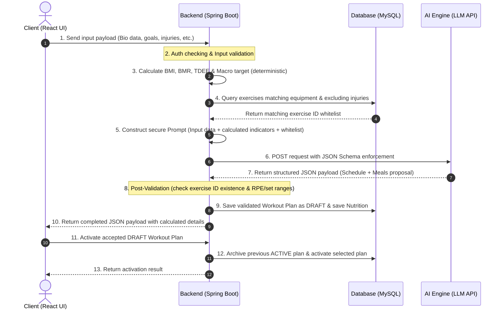

# ĐẶC TẢ YÊU CẦU CHỨC NĂNG VÀ CƠ CHẾ TÍCH HỢP AI (FUNCTIONAL REQUIREMENTS & AI INTEGRATION SPECIFICATION)

## 1. Bản đồ chức năng hệ thống (System Functional Map)
Trong giai đoạn MVP, hệ thống tập trung hoàn thiện các cấu phần chức năng cốt lõi sau:
- **Phân hệ Quản trị (Admin Module):** CRUD danh mục gói tập, CRUD thư viện bài tập gốc, kiểm soát tài khoản người dùng và giám sát thống kê tổng quan.
- **Phân hệ Hội viên (Member Module):** Quản lý hồ sơ thể chất (Bio Profile), đăng ký/gia hạn gói tập, lập lịch trình tập luyện thông minh, tự động tính toán chỉ số dinh dưỡng và ghi nhận nhật ký tập luyện thực tế (Workout Logs).
- **Phân hệ Huấn luyện viên (PT Module — Should-have, phát triển sau):** PT có thể xem danh sách hội viên phụ trách và lịch sử nhật ký tập luyện. PT có thể **tùy chọn** xem và điều chỉnh đề xuất AI sau khi đề xuất đã được cung cấp cho Member. Phân hệ PT không tham gia vào luồng bắt buộc của MVP.

---

## 2. Đặc tả Cơ chế Tích hợp AI và Luồng Dữ liệu Hybrid

### 2.1. Kiến trúc luồng dữ liệu Hybrid (Hybrid Data Pipeline)
Hệ thống vận hành theo cơ chế Hybrid: Tách biệt phần **Tính toán tất định** (các chỉ số sinh học cứng do Backend xử lý) và **Đề xuất linh hoạt** (lịch tập và cấu trúc bữa ăn do AI Engine tối ưu hóa). Quy trình xử lý dữ liệu được thiết kế tuần tự như sau:



### 2.2. Phân định vai trò và Trách nhiệm xử lý

#### A. Dữ liệu đầu vào (Input Payload từ Client)
Người dùng cập nhật thông tin cá nhân lên Client, dữ liệu được đóng gói thành JSON Payload gửi lên Backend gồm:
- **Thông số sinh học:** Giới tính (`gender`), ngày sinh (`dateOfBirth`), chiều cao (`heightCm`), cân nặng (`weightKg`).
- **Mục tiêu & Kinh nghiệm:** Mục tiêu thể chất (`fitnessGoal`: `BULK` / `CUT` / `MAINTAIN`), trình độ luyện tập (`fitnessLevel`: `BEGINNER` / `INTERMEDIATE` / `ADVANCED`), mức độ hoạt động hàng ngày (`activityLevel`: `SEDENTARY` / `LIGHTLY_ACTIVE` / `MODERATELY_ACTIVE` / `VERY_ACTIVE`).
- **Ràng buộc thời gian:** Tần suất tập luyện (`workoutDaysPerWeek`: số buổi/tuần), thời lượng tối đa mỗi buổi (`maxSessionMinutes`).
- **Ràng buộc vật lý & Y tế:** Thiết bị tập luyện khả dụng (`availableEquipment`), các nhóm cơ ưu tiên (`targetMuscleGroups`), chấn thương hoặc hạn chế vận động (`injuryConstraints` — ánh xạ sang `contraindicationTags` khi lọc Exercise Whitelist).
- **Dữ liệu dinh dưỡng:** Chế độ ăn (`dietaryPreference`: `OMNIVORE` / `VEGETARIAN` / `VEGAN`), dị ứng thực phẩm (`foodAllergies`), thực phẩm loại trừ (`excludedFoods`), số bữa mong muốn/ngày (`mealsPerDay`).

#### B. Trách nhiệm xử lý độc lập của Backend (Spring Boot)
Tầng Backend đảm nhận vai trò bộ lọc bảo mật, xử lý số liệu chính xác và kiểm soát nghiệp vụ:
1. **Xác thực & Phân quyền:** Xác minh JWT Token hợp lệ; `SubscriptionGuard` kiểm tra động gói tập theo điều kiện `status = ACTIVE`, `startDate <= currentDate < endDate` tại các thao tác tạo recommendation, kích hoạt giáo án và ghi workout log mới.
2. **Tính toán chỉ số sinh học cứng (Deterministic Logic):**
   - Áp dụng công thức Mifflin-St Jeor để tính chỉ số trao đổi chất cơ bản BMR.
   - Nhân hệ số vận động để ra chỉ số tiêu thụ năng lượng hàng ngày TDEE.
   - Tính toán lượng Calorie mục tiêu dựa trên TDEE và mục tiêu tập luyện (ví dụ: thâm hụt 300-500 kcal cho việc giảm mỡ, thặng dư 200-300 kcal cho việc tăng cơ).
   - Phân bổ chính xác khối lượng các chất đa lượng (Macronutrients) theo gram: Protein (2g - 2.5g trên mỗi kg trọng lượng), Fat (20% - 25% tổng năng lượng), còn lại phân bổ cho Carbohydrate.
3. **Lọc danh mục bài tập khả dụng (Exercise Whitelisting):** Truy vấn cơ sở dữ liệu MySQL, lọc ra danh sách các bài tập phù hợp với thiết bị sẵn có của người dùng và lọc bỏ các bài tập tác động xấu đến vùng chấn thương. Tạo danh sách `exercise_id_whitelist`.
4. **Xây dựng Prompt an toàn:** Gộp dữ liệu hồ sơ thể trạng, các chỉ số dinh dưỡng vừa tính toán và danh sách ID bài tập được phép sử dụng vào cấu trúc Prompt System/User gửi đi.
5. **Hậu kiểm dữ liệu (Post-Validation Hook):** Khi nhận được phản hồi từ AI, Backend tiến hành bóc tách thực thể JSON, thực hiện kiểm tra chéo và chuẩn hóa:
   - Nếu phản hồi từ AI chứa **bất kỳ** `exerciseId` nào nằm ngoài danh sách Whitelist, Backend **từ chối toàn bộ AI Response** và tiến hành Retry tối đa 1 lần. Nếu Retry vẫn thất bại, kích hoạt cơ chế Fallback giáo án mẫu cố định từ DB. **Không tự động tìm bài tập tương đương trong MVP.**
   - Số lượng `plannedSets` (1–5), `plannedReps` (1–30), mức `plannedRpe` (6–9), thời gian nghỉ `restSeconds` (30–300 giây) có nằm trong ngưỡng an toàn hay không.
- `workoutSchedule` phải có đúng `workoutDaysPerWeek` phần tử; `dayNumber` phải duy nhất, liên tục từ 1 đến `workoutDaysPerWeek`; mỗi ngày phải có ít nhất một bài tập và không được lặp cùng `exerciseId` trong một ngày.
   - `nutritionPlan.mealStructure` phải có đúng `mealsPerDay` phần tử; các món ăn phải vượt qua kiểm tra lại theo `dietaryPreference`, `foodAllergies` và `excludedFoods` trước khi được lưu.
   - Khi hội viên ghi nhật ký, Backend validate riêng dữ liệu thực tế: `actualSets` (1–10), `actualReps` (1–100), `actualRpe` (1–10) và `weightUsedKg` (≥ 0). Các giá trị này không thuộc AI Output Schema.
   - **Quy tắc chuẩn hóa dữ liệu tĩnh:** Tầng Backend chỉ trích xuất `exerciseId` từ payload của AI gửi về để kiểm tra chéo với Whitelist. Sau đó, hệ thống tự động thực hiện Map/Join dữ liệu để lấy ra `exerciseName` chuẩn gốc từ Master Data trong MySQL của hệ thống trước khi lưu, thay vì tin cậy hoàn toàn vào chuỗi ký tự `exerciseName` do AI sinh ra.
6. **Lưu trữ dữ liệu:** Lưu giáo án đã được kiểm chứng ở trạng thái `DRAFT` và lưu thực đơn vào Database thông qua JPA Repository. Khi Member chấp nhận giáo án, Backend chuyển giáo án `ACTIVE` cũ sang `ARCHIVED` và kích hoạt giáo án `DRAFT` mới trong cùng transaction; mỗi Member chỉ có tối đa một giáo án `ACTIVE`.

#### C. Trách nhiệm xử lý của AI Engine (Mô hình LLM thương mại)
AI đóng vai trò như một bộ máy lập lịch trình và định dạng dữ liệu (Optimizer & Formatter). **AI không được phép tự tính toán BMR, TDEE hay tổng Calorie:**
- **Lựa chọn mô hình phân chia lịch tập (Split Model Selection):** Lựa chọn mô hình phù hợp (như Push/Pull/Legs, Upper/Lower, Full Body) tùy thuộc vào số buổi tập/tuần và trình độ thể trạng của hội viên.
- **Sắp xếp bài tập:** Phân bổ các bài tập thuộc danh sách ID cho sẵn vào các ngày tập một cách khoa học (nguyên lý đảo nhóm cơ phục hồi). Số Workout Day phải khớp chính xác với số ngày tập hội viên yêu cầu mỗi tuần.
- **Định lượng thông số chuyển động:** Đưa ra khuyến nghị cụ thể về số `plannedSets` **(1–5)**, `plannedReps` **(1–30)**, chỉ số `plannedRpe` **(6–9)** và thời gian nghỉ `restSeconds` **(30–300 giây)** cho từng bài tập.
- **Phân chia thực đơn mẫu:** Phân bổ tổng lượng Calorie và Macronutrients **do Backend cung cấp** thành các bữa ăn thực tế trong ngày, đề xuất các món ăn tương ứng. AI **không tự xác định** `dailyCalorieTarget` hay `macroTargets`.
- **Lập luận chuyên môn (Explanations):** Đưa ra lý giải súc tích cho cấu trúc lịch tập và thực đơn đề xuất.

### 2.3. Quy tắc tương tác và Cơ chế chống ảo giác (Anti-Hallucination)
Nhằm giảm thiểu hiện tượng ảo giác (Hallucination) của AI tạo sinh trong bối cảnh dữ liệu sức khỏe và thể chất, hệ thống triển khai 3 rào cản phòng vệ:
1. **Cô lập tính toán số liệu học thuật:** AI không được tự tính toán BMR, TDEE hay Calorie. Các chỉ số này được Backend tính toán theo công thức khoa học cứng (Mifflin-St Jeor, hệ số hoạt động), tạo ra kết quả **tất định, nhất quán và có thể kiểm thử theo công thức đã lựa chọn**, rồi chuyển sang cho AI dưới dạng tham số bất biến.
2. **Kẹp chặt phạm vi dữ liệu bài tập (ID Whitelisting):** AI không được tự ý sinh tên bài tập lạ. AI chỉ được sắp xếp các bài tập trong danh sách ID mà Backend cung cấp. **Toàn bộ phản hồi chứa bất kỳ ID nào nằm ngoài whitelist sẽ bị từ chối** — không lọc bỏ từng phần tử.
3. **Ép kiểu phản hồi có cấu trúc (Strict JSON Schema):** Sử dụng tính năng Structured Outputs của các LLM API hiện đại, ép buộc mô hình phải trả về JSON tuân thủ chính xác Schema định nghĩa trước. Nếu cấu trúc trả về sai định dạng, Backend từ chối toàn bộ phản hồi, Retry tối đa 1 lần; nếu lần Retry vẫn thất bại thì mới kích hoạt Fallback Template an toàn.

---

## 3. Đặc tả cấu trúc dữ liệu JSON Schema (Structured Output Schema)

### 3.1. JSON Schema bắt buộc cho AI Output

AI Engine bắt buộc chỉ trả về phần `workoutSchedule` và `nutritionPlan.mealStructure`. **AI không được phép đưa `dailyCalorieTarget`, `macroTargets` hay bất kỳ trường số liệu sinh học nào vào phản hồi.** Backend sẽ tự ghép sau khi kiểm chứng.

```json
{
  "$schema": "http://json-schema.org/draft-07/schema#",
  "title": "AiRecommendationOutput",
  "type": "object",
  "required": ["splitModel", "explanation", "workoutSchedule", "nutritionPlan"],
  "additionalProperties": false,
  "properties": {
    "splitModel": { "type": "string", "minLength": 1, "maxLength": 100 },
    "explanation": { "type": "string", "minLength": 10, "maxLength": 1000 },
    "workoutSchedule": {
      "type": "array",
      "minItems": 1,
      "items": {
        "type": "object",
        "required": ["dayNumber", "dayName", "exercises"],
        "additionalProperties": false,
        "properties": {
          "dayNumber": { "type": "integer", "minimum": 1 },
          "dayName": { "type": "string", "minLength": 1, "maxLength": 100 },
          "exercises": {
            "type": "array",
            "minItems": 1,
            "items": {
              "type": "object",
              "required": ["exerciseId", "plannedSets", "plannedReps", "plannedRpe", "restSeconds"],
              "additionalProperties": false,
              "properties": {
                "exerciseId": { "type": "integer", "minimum": 1 },
                "plannedSets": { "type": "integer", "minimum": 1, "maximum": 5 },
                "plannedReps": { "type": "integer", "minimum": 1, "maximum": 30 },
                "plannedRpe": { "type": "integer", "minimum": 6, "maximum": 9 },
                "restSeconds": { "type": "integer", "minimum": 30, "maximum": 300 },
                "notes": { "type": "string", "maxLength": 500 }
              }
            }
          }
        }
      }
    },
    "nutritionPlan": {
      "type": "object",
      "required": ["mealStructure"],
      "additionalProperties": false,
      "properties": {
        "mealStructure": {
          "type": "array",
          "minItems": 1,
          "maxItems": 6,
          "items": {
            "type": "object",
            "required": ["mealName", "timeSuggest", "foods", "description"],
            "additionalProperties": false,
            "properties": {
              "mealName": { "type": "string", "minLength": 1, "maxLength": 100 },
              "timeSuggest": {
                "type": "string",
                "pattern": "^([01][0-9]|2[0-3]):[0-5][0-9]$"
              },
              "foods": {
                "type": "array",
                "minItems": 1,
                "maxItems": 20,
                "items": { "type": "string", "minLength": 1, "maxLength": 100 }
              },
              "description": { "type": "string", "minLength": 1, "maxLength": 500 }
            }
          }
        }
      }
    }
  }
}
```

> **Lưu ý quan trọng:** Trường `exerciseName` bị loại khỏi AI output schema (`additionalProperties: false`). Backend tự tra tên từ Master Data bằng `exerciseId` sau khi hậu kiểm, tránh hoàn toàn rủi ro AI sinh sai tên bài tập.

---

### 3.2. Cấu trúc phản hồi hoàn chỉnh trả về Client (Merged Backend Response)

Sau khi hậu kiểm thành công, Backend ghép kết quả tính toán với đề xuất AI và trả về Client theo cấu trúc:

```json
{
  "recommendationSource": "AI_GENERATED",
  "calculatedTargets": {
    "bmr": 1750,
    "tdee": 2275,
    "dailyCaloriesKcal": 2200,
    "proteinGrams": 165,
    "carbGrams": 220,
    "fatGrams": 73
  },
  "aiSuggestion": {
    "splitModel": "Push/Pull/Legs",
    "explanation": "Lịch tập được thiết kế 3 buổi/tuần...",
    "workoutSchedule": [
      {
        "dayNumber": 1,
        "dayName": "Buổi 1: Push (Ngực, Vai, Tay sau)",
        "exercises": [
          {
            "exerciseId": 101,
            "exerciseName": "Flat Dumbbell Press",
            "plannedSets": 4,
            "plannedReps": 8,
            "plannedRpe": 8,
            "restSeconds": 90,
            "notes": "Tập trung kiểm soát biên độ chuyển động."
          }
        ]
      }
    ],
    "nutritionPlan": {
      "mealStructure": [
        {
          "mealName": "Bữa sáng",
          "timeSuggest": "07:30",
          "foods": ["3 quả trứng gà luộc", "100g yến mạch"],
          "description": "Bữa sáng giàu protein giúp hồi phục cơ bắp tốt."
        }
      ]
    }
  }
}
```

Khi Fallback được kích hoạt (AI lỗi hoặc bị từ chối sau retry):

```json
{
  "recommendationSource": "FALLBACK_TEMPLATE",
  "warningCode": "AI_RESPONSE_INVALID",
  "calculatedTargets": {
    "bmr": 1750,
    "tdee": 2275,
    "dailyCaloriesKcal": 2200,
    "proteinGrams": 165,
    "carbGrams": 220,
    "fatGrams": 73
  },
  "aiSuggestion": {
    "splitModel": "Full Body 3 Days",
    "explanation": "Giáo án mẫu tĩnh phù hợp với hội viên mới tập ba buổi mỗi tuần.",
    "workoutSchedule": [
      {
        "dayNumber": 1,
        "dayName": "Buổi 1: Full Body A",
        "exercises": [
          {
            "exerciseId": 101,
            "exerciseName": "Flat Dumbbell Press",
            "plannedSets": 3,
            "plannedReps": 10,
            "plannedRpe": 7,
            "restSeconds": 90,
            "notes": "Kiểm soát biên độ chuyển động và giữ nhịp thở ổn định."
          }
        ]
      },
      {
        "dayNumber": 2,
        "dayName": "Buổi 2: Full Body B",
        "exercises": [
          {
            "exerciseId": 205,
            "exerciseName": "Cable Seated Row",
            "plannedSets": 3,
            "plannedReps": 12,
            "plannedRpe": 7,
            "restSeconds": 90,
            "notes": "Giữ thân người ổn định và kéo bằng cơ lưng."
          }
        ]
      },
      {
        "dayNumber": 3,
        "dayName": "Buổi 3: Full Body C",
        "exercises": [
          {
            "exerciseId": 309,
            "exerciseName": "Goblet Squat",
            "plannedSets": 3,
            "plannedReps": 10,
            "plannedRpe": 7,
            "restSeconds": 90,
            "notes": "Giữ cột sống trung lập và thực hiện trong biên độ phù hợp."
          }
        ]
      }
    ],
    "nutritionPlan": {
      "mealStructure": [
        {
          "mealName": "Bữa sáng",
          "timeSuggest": "07:30",
          "foods": ["3 quả trứng gà luộc", "100g yến mạch"],
          "description": "Bữa sáng mẫu giàu protein và carbohydrate phức hợp."
        },
        {
          "mealName": "Bữa trưa",
          "timeSuggest": "12:00",
          "foods": ["200g ức gà", "150g cơm gạo lứt", "Rau xanh"],
          "description": "Bữa chính mẫu hỗ trợ cung cấp năng lượng cho buổi tập."
        },
        {
          "mealName": "Bữa tối",
          "timeSuggest": "19:00",
          "foods": ["150g cá hồi", "100g khoai lang", "Salad rau xanh"],
          "description": "Bữa tối mẫu hỗ trợ phục hồi sau tập luyện."
        }
      ]
    }
  }
}
```

---

## 4. Đặc tả Exercise Library — Trường dữ liệu phục vụ lọc hạn chế vận động

Để Backend có thể lọc chính xác danh sách bài tập phù hợp với từng hội viên (đặc biệt khi có chấn thương), mỗi bản ghi Exercise trong DB cần có các trường metadata sau:

| Trường | Kiểu dữ liệu | Mô tả |
| :--- | :--- | :--- |
| `id` | `Long` | Khóa chính |
| `name` | `String` | Tên bài tập chuẩn |
| `primaryMuscleGroup` | `Enum` | Nhóm cơ chính tác động (CHEST, BACK, SHOULDERS, ARMS, LEGS, GLUTES, CORE, CARDIO, FULL_BODY) |
| `secondaryMuscleGroups` | `Set<Enum>` | Các nhóm cơ phụ, dùng cùng tập giá trị với `primaryMuscleGroup` |
| `movementPattern` | `Enum` | Kiểu chuyển động (PUSH, PULL, HINGE, SQUAT, LUNGE, CARRY, ROTATION) |
| `targetBodyRegions` | `Set<Enum>` | Vùng cơ thể tác động (UPPER_BODY, LOWER_BODY, CORE, FULL_BODY) |
| `equipmentRequired` | `Set<Enum>` | Thiết bị vật lý cần thiết (BARBELL, DUMBBELL, CABLE, MACHINE, BENCH, ...); bài bodyweight dùng tập rỗng |
| `difficultyLevel` | `Enum` | Độ khó (BEGINNER, INTERMEDIATE, ADVANCED) |
| `contraindicationTags` | `Set<Enum>` | Danh sách chống chỉ định — **cột quan trọng nhất để lọc** |
| `instructionText` | `Text` | Hướng dẫn thực hiện |
| `isActive` | `Boolean` | Trạng thái Soft Delete |

**Các giá trị `contraindicationTags` tiêu biểu:**

```text
KNEE_FLEXION_LIMITED       — Hạn chế gấp gối (chấn thương dây chằng, meniscus)
OVERHEAD_MOVEMENT_LIMITED  — Hạn chế nâng trên đầu (chấn thương vai, rotator cuff)
LOWER_BACK_LOAD_LIMITED    — Hạn chế tải trọng lưng dưới (thoát vị đĩa đệm)
WRIST_FLEXION_LIMITED      — Hạn chế gấp cổ tay
NECK_LOAD_LIMITED          — Hạn chế tải trọng vùng cổ
```

**Logic lọc tại Backend:**

```java
// Lấy tập contraindicationTags từ injuryConstraints của Member
// Lưu ý: injuryConstraints của Member được thiết kế ánh xạ cùng enum/ngữ nghĩa trực tiếp với contraindicationTags của Exercise.
Set<ContraindicationTag> memberRestrictions = member.getInjuryConstraints();

// Quy ước: bài bodyweight có equipmentRequired rỗng.
// Lọc bài tập: chỉ lấy bài có đủ thiết bị và không có tag nào trùng với hạn chế của Member
List<Exercise> whitelist = exerciseRepo.findAll().stream()
    .filter(ex -> ex.isActive()
        && (ex.getEquipmentRequired().isEmpty()
            || availableEquipment.containsAll(ex.getEquipmentRequired()))
        && Collections.disjoint(ex.getContraindicationTags(), memberRestrictions))
    .collect(Collectors.toList());
```
