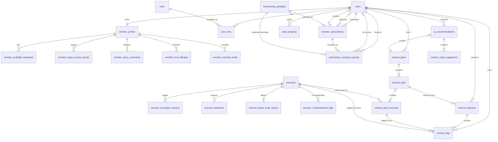

# 11. Thiết kế Cơ sở dữ liệu

## 1. Mục đích tài liệu

Tài liệu này đặc tả thiết kế vật lý của cơ sở dữ liệu cho Hệ thống quản lý phòng gym thông minh trong phạm vi sản phẩm khả dụng tối thiểu. Thiết kế sử dụng MySQL 8 và bao gồm đầy đủ 25 bảng vật lý, kiểu dữ liệu, khóa chính, khóa ngoại, ràng buộc duy nhất, ràng buộc kiểm tra, trường auditing, chỉ mục, chiến lược bảo toàn lịch sử và sơ đồ quan hệ thực thể.

Tài liệu là nguồn thiết kế cho:

- Mã nguồn Java Spring Boot và Spring Data Java Persistence API.
- Các Entity, Embeddable, Data Transfer Object và Repository.
- File migration Flyway được tạo trong giai đoạn hiện thực.
- Việc kiểm thử các quy tắc nghiệp vụ tại tầng ứng dụng và tầng cơ sở dữ liệu.

Thiết kế kế thừa trực tiếp từ:

- `docs/05-business-rules.md`.
- `docs/08-functional-requirements-detail.md`.
- `docs/09-use-case-specification.md`.
- `docs/10-api-draft.md`.

---

## 2. Nguyên tắc thiết kế database

Hệ thống tuân thủ 16 nguyên tắc sau:

1. **Hệ quản trị:** Sử dụng MySQL 8 với Storage Engine InnoDB để hỗ trợ transaction, khóa ngoại và kiểm soát đồng thời.
2. **Bộ mã ký tự:** Sử dụng `utf8mb4` và collation `utf8mb4_unicode_ci` để lưu đầy đủ tiếng Việt.
3. **Quy tắc đặt tên:** Tên bảng, tên cột, khóa và chỉ mục dùng `snake_case`; thuộc tính Java dùng `camelCase`.
4. **Khóa chính:** Bảng thực thể nghiệp vụ dùng `BIGINT AUTO_INCREMENT`; bảng liên kết và bảng collection dùng khóa chính ghép có ý nghĩa nghiệp vụ.
5. **Mật khẩu và bí mật:** Chỉ lưu `password_hash` đã mã hóa bằng BCrypt. Không lưu mật khẩu dạng văn bản thuần, JSON Web Token, JWT Secret hoặc khóa giao diện lập trình ứng dụng của nhà cung cấp AI.
6. **Anonymous Guest:** Anonymous Guest là tác nhân chưa xác thực và không được lưu thành `ROLE_GUEST` trong database.
7. **Personal Trainer:** Chỉ khai báo `ROLE_PT` trong bảng vai trò để sẵn sàng mở rộng. MVP không có bảng nghiệp vụ Personal Trainer và không có luồng Admin–Member nào phụ thuộc Personal Trainer.
8. **Enum:** Giá trị Enum được lưu bằng `VARCHAR` và ánh xạ bằng `EnumType.STRING` để tránh sai lệch khi thay đổi thứ tự Enum trong mã nguồn.
9. **Thời gian:** `TIMESTAMP` lưu theo UTC. Trường `DATE` phục vụ nghiệp vụ được xác định theo timezone `Asia/Ho_Chi_Minh` trước khi lưu.
10. **Auditing:** Cả 25 bảng vật lý đều có `created_at` và `updated_at`. Mười sáu bảng ánh xạ Entity dùng Java Persistence Auditing. Chín bảng `@ElementCollection` không có lifecycle callback riêng nên MySQL điền timestamp bằng default/on-update trong cùng transaction với thao tác collection.
11. **Xóa mềm:** `membership_packages` và `exercises` dùng `is_active`; không xóa cứng master data đã được tham chiếu.
12. **Bảo toàn lịch sử:** Subscription, renewal request, workout plan, workout log, body progress và AI recommendation không bị xóa lan truyền từ User hoặc master data.
13. **Cascade có kiểm soát:** Chỉ dùng `ON DELETE CASCADE` cho bảng liên kết hoặc thành phần sở hữu hoàn toàn. Dữ liệu lịch sử dùng `ON DELETE RESTRICT`.
14. **Backend sở hữu tính toán:** BMI, BMR, TDEE, calories và macros chính thức chỉ do Backend tính. AI không được phép trả hoặc thay đổi các giá trị này.
15. **Cô lập AI:** AI chỉ tạo `workoutSchedule` và `nutritionPlan.mealStructure`. Chỉ snapshot đã vượt qua hậu kiểm schema, whitelist và giới hạn planned values mới được lưu.
16. **Toàn vẹn transaction:** Duyệt subscription, duyệt renewal, kích hoạt workout plan và update-in-place phải thực hiện nguyên tử. Các bảng dễ xung đột sử dụng `version` cho optimistic locking và unique key để chống race condition.

### 2.1. Quy ước khóa ngoại

- `member_id` luôn tham chiếu `users.id`; tầng Service xác minh User có `ROLE_MEMBER`.
- `approved_by_user_id`, `cancelled_by_user_id` và `processed_by_user_id` tham chiếu `users.id`; tầng Service xác minh User có `ROLE_ADMIN`.
- Khóa ngoại đến dữ liệu lịch sử dùng `ON DELETE RESTRICT`.
- Khóa ngoại từ bảng cha đến bảng collection dùng `ON DELETE CASCADE` vì collection không tồn tại độc lập.

### 2.2. Quy ước auditing

- `created_at`: thời điểm tạo bản ghi, không thay đổi sau khi insert.
- `updated_at`: thời điểm thay đổi bản ghi gần nhất.
- Cả hai trường dùng `TIMESTAMP(6)` để giữ độ chính xác tới microsecond và lưu theo UTC.
- Đối với chín bảng collection, DDL bắt buộc dùng `created_at TIMESTAMP(6) NOT NULL DEFAULT CURRENT_TIMESTAMP(6)` và `updated_at TIMESTAMP(6) NOT NULL DEFAULT CURRENT_TIMESTAMP(6) ON UPDATE CURRENT_TIMESTAMP(6)`. Các bảng Entity còn lại do Spring Data JPA Auditing ghi giá trị.

---

## 3. Danh sách bảng tổng quan

| Số thứ tự | Tên bảng vật lý | Phân hệ | Mục đích |
|---:|---|---|---|
| 1 | `users` | Auth | Lưu tài khoản và trạng thái phục vụ AccountStatusGuard. |
| 2 | `roles` | Auth | Lưu ba vai trò xác thực của hệ thống. |
| 3 | `user_roles` | Auth | Liên kết nhiều-nhiều giữa User và Role. |
| 4 | `member_profiles` | Profile | Lưu hồ sơ thể chất, mục tiêu và cấu hình dinh dưỡng. |
| 5 | `member_available_equipment` | Profile | Lưu thiết bị hội viên có thể sử dụng. |
| 6 | `member_target_muscle_groups` | Profile | Lưu nhóm cơ hội viên ưu tiên. |
| 7 | `member_injury_constraints` | Profile | Lưu hạn chế vận động dùng để lọc bài tập. |
| 8 | `member_food_allergies` | Profile | Lưu thành phần thực phẩm gây dị ứng. |
| 9 | `member_excluded_foods` | Profile | Lưu thực phẩm hội viên không sử dụng. |
| 10 | `membership_packages` | Membership | Lưu danh mục gói tập. |
| 11 | `member_subscriptions` | Membership | Lưu yêu cầu đăng ký mới và subscription đã kích hoạt. |
| 12 | `subscription_renewal_requests` | Membership | Lưu yêu cầu gia hạn tách biệt theo BR-24. |
| 13 | `exercises` | Exercise | Lưu master data bài tập. |
| 14 | `exercise_secondary_muscles` | Exercise | Lưu nhóm cơ phụ của bài tập. |
| 15 | `exercise_equipment` | Exercise | Lưu thiết bị bắt buộc của bài tập. |
| 16 | `exercise_target_body_regions` | Exercise | Lưu vùng cơ thể chịu tác động. |
| 17 | `exercise_contraindication_tags` | Exercise | Lưu thẻ chống chỉ định. |
| 18 | `workout_plans` | Workout Plan | Lưu giáo án của hội viên. |
| 19 | `workout_days` | Workout Plan | Lưu các ngày tập trong giáo án. |
| 20 | `workout_plan_exercises` | Workout Plan | Lưu bài tập và planned values trong từng ngày. |
| 21 | `workout_sessions` | Workout Log | Lưu buổi tập thực tế của hội viên theo ngày. |
| 22 | `workout_logs` | Workout Log | Lưu actual values của từng bài tập. |
| 23 | `body_progress` | Progress | Lưu cân nặng theo ngày. |
| 24 | `ai_recommendations` | AI/Nutrition | Lưu calculated targets và snapshot đề xuất đã hậu kiểm. |
| 25 | `nutrition_meal_suggestions` | AI/Nutrition | Lưu từng bữa trong meal structure. |

---

## 4. Chi tiết từng bảng

### 4.1. Nhóm Auth

#### 4.1.1. Bảng `users`

**Mục đích:** Lưu tài khoản. `AccountStatusGuard` đọc `account_status` theo User ID trong Security Context để chặn tài khoản `LOCKED` hoặc `DISABLED`.

| Tên cột | Kiểu dữ liệu | Ràng buộc | Mô tả |
|---|---|---|---|
| `id` | BIGINT | PRIMARY KEY, AUTO_INCREMENT | Định danh User. |
| `full_name` | VARCHAR(100) | NOT NULL | Họ tên đầy đủ. |
| `email` | VARCHAR(150) | NOT NULL | Email đã trim và chuyển lowercase. |
| `password_hash` | VARCHAR(255) | NOT NULL | Mật khẩu đã mã hóa bằng BCrypt. |
| `account_status` | VARCHAR(20) | NOT NULL, DEFAULT `'ACTIVE'`, CHECK (`account_status IN ('ACTIVE','LOCKED','DISABLED')`) | Trạng thái tài khoản. |
| `created_at` | TIMESTAMP(6) | NOT NULL | Thời điểm tạo theo UTC. |
| `updated_at` | TIMESTAMP(6) | NOT NULL | Thời điểm cập nhật theo UTC. |

**Unique Constraint:** `uk_users_email(email)`.

#### 4.1.2. Bảng `roles`

**Mục đích:** Lưu `ROLE_ADMIN`, `ROLE_MEMBER`, `ROLE_PT`. Không có `ROLE_GUEST`.

| Tên cột | Kiểu dữ liệu | Ràng buộc | Mô tả |
|---|---|---|---|
| `id` | BIGINT | PRIMARY KEY, AUTO_INCREMENT | Định danh Role. |
| `name` | VARCHAR(50) | NOT NULL, CHECK (`name IN ('ROLE_ADMIN','ROLE_MEMBER','ROLE_PT')`) | Tên vai trò xác thực. |
| `created_at` | TIMESTAMP(6) | NOT NULL | Thời điểm tạo theo UTC. |
| `updated_at` | TIMESTAMP(6) | NOT NULL | Thời điểm cập nhật theo UTC. |

**Unique Constraint:** `uk_roles_name(name)`.

#### 4.1.3. Bảng `user_roles`

**Mục đích:** Liên kết User và Role.

| Tên cột | Kiểu dữ liệu | Ràng buộc | Mô tả |
|---|---|---|---|
| `user_id` | BIGINT | NOT NULL, FOREIGN KEY → `users.id`, ON DELETE CASCADE | User được gán vai trò. |
| `role_id` | BIGINT | NOT NULL, FOREIGN KEY → `roles.id`, ON DELETE RESTRICT | Vai trò được gán. |
| `created_at` | TIMESTAMP(6) | NOT NULL | Thời điểm gán theo UTC. |
| `updated_at` | TIMESTAMP(6) | NOT NULL | Thời điểm cập nhật theo UTC. |

**Primary Key:** `pk_user_roles(user_id, role_id)`.

---

### 4.2. Nhóm Profile

#### 4.2.1. Bảng `member_profiles`

**Mục đích:** Lưu dữ liệu đầu vào cho tính BMI, BMR, TDEE, calories, macros và cá nhân hóa recommendation.

| Tên cột | Kiểu dữ liệu | Ràng buộc | Mô tả |
|---|---|---|---|
| `id` | BIGINT | PRIMARY KEY, AUTO_INCREMENT | Định danh hồ sơ. |
| `user_id` | BIGINT | NOT NULL, FOREIGN KEY → `users.id`, ON DELETE RESTRICT | User sở hữu hồ sơ. |
| `gender` | VARCHAR(10) | NOT NULL, CHECK (`gender IN ('MALE','FEMALE')`) | Giới tính sinh học dùng để chọn đúng nhánh công thức BMR Mifflin-St Jeor trong MVP. |
| `date_of_birth` | DATE | NOT NULL | Ngày sinh dùng để tính tuổi. |
| `height_cm` | DECIMAL(5,2) | NOT NULL, CHECK (`height_cm > 0`) | Chiều cao theo centimet. |
| `weight_kg` | DECIMAL(6,2) | NOT NULL, CHECK (`weight_kg > 0`) | Cân nặng theo kilogram. |
| `fitness_goal` | VARCHAR(20) | NOT NULL, CHECK (`fitness_goal IN ('BULK','CUT','MAINTAIN')`) | Mục tiêu thể chất. |
| `fitness_level` | VARCHAR(20) | NOT NULL, CHECK (`fitness_level IN ('BEGINNER','INTERMEDIATE','ADVANCED')`) | Trình độ tập luyện. |
| `activity_level` | VARCHAR(30) | NOT NULL, CHECK (`activity_level IN ('SEDENTARY','LIGHTLY_ACTIVE','MODERATELY_ACTIVE','VERY_ACTIVE')`) | Hệ số hoạt động để tính TDEE. |
| `workout_days_per_week` | TINYINT | NOT NULL, CHECK (`workout_days_per_week BETWEEN 1 AND 7`) | Số buổi tập mỗi tuần. |
| `max_session_minutes` | SMALLINT | NOT NULL, CHECK (`max_session_minutes > 0`) | Thời lượng tối đa mỗi buổi. |
| `dietary_preference` | VARCHAR(20) | NOT NULL, CHECK (`dietary_preference IN ('OMNIVORE','VEGETARIAN','VEGAN')`) | Chế độ ăn. |
| `meals_per_day` | TINYINT | NOT NULL, CHECK (`meals_per_day BETWEEN 1 AND 6`) | Số bữa mỗi ngày theo BR-23. |
| `created_at` | TIMESTAMP(6) | NOT NULL | Thời điểm tạo theo UTC. |
| `updated_at` | TIMESTAMP(6) | NOT NULL | Thời điểm cập nhật theo UTC. |

**Unique Constraint:** `uk_member_profiles_user(user_id)`.

**Application Validation:** `date_of_birth` không được ở tương lai. Giới hạn chi tiết chiều cao, cân nặng và thời lượng được kiểm tra tại Data Transfer Object; database bảo vệ điều kiện dương.

#### 4.2.2. Bảng `member_available_equipment`

| Tên cột | Kiểu dữ liệu | Ràng buộc | Mô tả |
|---|---|---|---|
| `member_profile_id` | BIGINT | NOT NULL, FOREIGN KEY → `member_profiles.id`, ON DELETE CASCADE | Hồ sơ sở hữu collection. |
| `equipment` | VARCHAR(50) | NOT NULL, CHECK (`equipment IN ('BARBELL','DUMBBELL','MACHINE','CABLE','BENCH')`) | Thiết bị hội viên sử dụng được. |
| `created_at` | TIMESTAMP(6) | NOT NULL, DEFAULT CURRENT_TIMESTAMP(6) | Thời điểm thêm do DB quản lý theo UTC. |
| `updated_at` | TIMESTAMP(6) | NOT NULL, DEFAULT CURRENT_TIMESTAMP(6), ON UPDATE CURRENT_TIMESTAMP(6) | Thời điểm cập nhật do DB quản lý theo UTC. |

**Primary Key:** `pk_member_available_equipment(member_profile_id, equipment)`.

#### 4.2.3. Bảng `member_target_muscle_groups`

| Tên cột | Kiểu dữ liệu | Ràng buộc | Mô tả |
|---|---|---|---|
| `member_profile_id` | BIGINT | NOT NULL, FOREIGN KEY → `member_profiles.id`, ON DELETE CASCADE | Hồ sơ sở hữu collection. |
| `muscle_group` | VARCHAR(50) | NOT NULL, CHECK (`muscle_group IN ('CHEST','BACK','SHOULDERS','ARMS','LEGS','GLUTES','CORE','CARDIO','FULL_BODY')`) | Nhóm cơ ưu tiên. |
| `created_at` | TIMESTAMP(6) | NOT NULL, DEFAULT CURRENT_TIMESTAMP(6) | Thời điểm thêm do DB quản lý theo UTC. |
| `updated_at` | TIMESTAMP(6) | NOT NULL, DEFAULT CURRENT_TIMESTAMP(6), ON UPDATE CURRENT_TIMESTAMP(6) | Thời điểm cập nhật do DB quản lý theo UTC. |

**Primary Key:** `pk_member_target_muscle_groups(member_profile_id, muscle_group)`.

#### 4.2.4. Bảng `member_injury_constraints`

| Tên cột | Kiểu dữ liệu | Ràng buộc | Mô tả |
|---|---|---|---|
| `member_profile_id` | BIGINT | NOT NULL, FOREIGN KEY → `member_profiles.id`, ON DELETE CASCADE | Hồ sơ sở hữu collection. |
| `constraint_tag` | VARCHAR(80) | NOT NULL, CHECK (`constraint_tag IN ('KNEE_FLEXION_LIMITED','OVERHEAD_MOVEMENT_LIMITED','LOWER_BACK_LOAD_LIMITED','WRIST_FLEXION_LIMITED','NECK_LOAD_LIMITED')`) | Hạn chế vận động. |
| `created_at` | TIMESTAMP(6) | NOT NULL, DEFAULT CURRENT_TIMESTAMP(6) | Thời điểm thêm do DB quản lý theo UTC. |
| `updated_at` | TIMESTAMP(6) | NOT NULL, DEFAULT CURRENT_TIMESTAMP(6), ON UPDATE CURRENT_TIMESTAMP(6) | Thời điểm cập nhật do DB quản lý theo UTC. |

**Primary Key:** `pk_member_injury_constraints(member_profile_id, constraint_tag)`.

#### 4.2.5. Bảng `member_food_allergies`

| Tên cột | Kiểu dữ liệu | Ràng buộc | Mô tả |
|---|---|---|---|
| `member_profile_id` | BIGINT | NOT NULL, FOREIGN KEY → `member_profiles.id`, ON DELETE CASCADE | Hồ sơ sở hữu collection. |
| `allergy_name` | VARCHAR(50) | NOT NULL | Thành phần gây dị ứng đã trim và loại control character. |
| `created_at` | TIMESTAMP(6) | NOT NULL, DEFAULT CURRENT_TIMESTAMP(6) | Thời điểm thêm do DB quản lý theo UTC. |
| `updated_at` | TIMESTAMP(6) | NOT NULL, DEFAULT CURRENT_TIMESTAMP(6), ON UPDATE CURRENT_TIMESTAMP(6) | Thời điểm cập nhật do DB quản lý theo UTC. |

**Primary Key:** `pk_member_food_allergies(member_profile_id, allergy_name)`.

**Application Validation:** Tối đa 10 phần tử; mỗi phần tử không quá 50 ký tự; không chứa phần tử rỗng.

#### 4.2.6. Bảng `member_excluded_foods`

| Tên cột | Kiểu dữ liệu | Ràng buộc | Mô tả |
|---|---|---|---|
| `member_profile_id` | BIGINT | NOT NULL, FOREIGN KEY → `member_profiles.id`, ON DELETE CASCADE | Hồ sơ sở hữu collection. |
| `food_name` | VARCHAR(50) | NOT NULL | Thực phẩm loại trừ đã trim và loại control character. |
| `created_at` | TIMESTAMP(6) | NOT NULL, DEFAULT CURRENT_TIMESTAMP(6) | Thời điểm thêm do DB quản lý theo UTC. |
| `updated_at` | TIMESTAMP(6) | NOT NULL, DEFAULT CURRENT_TIMESTAMP(6), ON UPDATE CURRENT_TIMESTAMP(6) | Thời điểm cập nhật do DB quản lý theo UTC. |

**Primary Key:** `pk_member_excluded_foods(member_profile_id, food_name)`.

**Application Validation:** Tối đa 10 phần tử; mỗi phần tử không quá 50 ký tự; không chứa phần tử rỗng.

---

### 4.3. Nhóm Membership

#### 4.3.1. Bảng `membership_packages`

**Mục đích:** Lưu master data gói tập. Vô hiệu hóa package không làm mất hiệu lực subscription đã ACTIVE.

| Tên cột | Kiểu dữ liệu | Ràng buộc | Mô tả |
|---|---|---|---|
| `id` | BIGINT | PRIMARY KEY, AUTO_INCREMENT | Định danh package. |
| `name` | VARCHAR(100) | NOT NULL | Tên hiển thị. |
| `normalized_name` | VARCHAR(100) | NOT NULL | Tên đã trim, chuyển lowercase và chuẩn hóa khoảng trắng. |
| `description` | VARCHAR(1000) | NULL | Mô tả package. |
| `duration_days` | SMALLINT | NOT NULL, CHECK (`duration_days BETWEEN 1 AND 3650`) | Thời lượng package theo BR-27. |
| `price` | DECIMAL(12,2) | NOT NULL, CHECK (`price >= 0`) | Giá package. |
| `is_active` | BOOLEAN | NOT NULL, DEFAULT TRUE | Cờ soft delete. |
| `created_at` | TIMESTAMP(6) | NOT NULL | Thời điểm tạo theo UTC. |
| `updated_at` | TIMESTAMP(6) | NOT NULL | Thời điểm cập nhật theo UTC. |

**Unique Constraint:** `uk_membership_packages_normalized_name(normalized_name)`.

#### 4.3.2. Bảng `member_subscriptions`

**Mục đích:** Lưu yêu cầu đăng ký mới ở trạng thái `PENDING` và subscription đã được duyệt. Không dùng bảng này để tạo một subscription ACTIVE mới khi gia hạn.

| Tên cột | Kiểu dữ liệu | Ràng buộc | Mô tả |
|---|---|---|---|
| `id` | BIGINT | PRIMARY KEY, AUTO_INCREMENT | Định danh subscription. |
| `member_id` | BIGINT | NOT NULL, FOREIGN KEY → `users.id`, ON DELETE RESTRICT | Member sở hữu subscription. |
| `package_id` | BIGINT | NOT NULL, FOREIGN KEY → `membership_packages.id`, ON DELETE RESTRICT | Package được đăng ký. |
| `package_name_snapshot` | VARCHAR(100) | NOT NULL | Tên package tại thời điểm tạo yêu cầu. |
| `package_duration_days_snapshot` | SMALLINT | NOT NULL, CHECK (`package_duration_days_snapshot BETWEEN 1 AND 3650`) | Thời lượng được chốt. |
| `package_price_snapshot` | DECIMAL(12,2) | NOT NULL, CHECK (`package_price_snapshot >= 0`) | Giá được chốt. |
| `status` | VARCHAR(20) | NOT NULL, DEFAULT `'PENDING'`, CHECK (`status IN ('PENDING','ACTIVE','EXPIRED','CANCELLED')`) | Vòng đời subscription. |
| `start_date` | DATE | NULL | Ngày bắt đầu sau khi duyệt. |
| `end_date` | DATE | NULL | Mốc hết hiệu lực dạng exclusive. |
| `approved_by_user_id` | BIGINT | NULL, FOREIGN KEY → `users.id`, ON DELETE RESTRICT | Admin phê duyệt. |
| `approved_at` | TIMESTAMP(6) | NULL | Thời điểm phê duyệt theo UTC. |
| `cancelled_by_user_id` | BIGINT | NULL, FOREIGN KEY → `users.id`, ON DELETE RESTRICT | Admin hủy. |
| `cancelled_at` | TIMESTAMP(6) | NULL | Thời điểm hủy theo UTC. |
| `version` | BIGINT | NOT NULL, DEFAULT 0 | Optimistic locking. |
| `active_member_key` | BIGINT GENERATED ALWAYS AS (`CASE WHEN status = 'ACTIVE' THEN member_id ELSE NULL END`) STORED | NULL | Khóa kỹ thuật chống hai subscription ACTIVE. |
| `pending_member_key` | BIGINT GENERATED ALWAYS AS (`CASE WHEN status = 'PENDING' THEN member_id ELSE NULL END`) STORED | NULL | Khóa kỹ thuật chống hai yêu cầu đăng ký mới PENDING. |
| `created_at` | TIMESTAMP(6) | NOT NULL | Thời điểm tạo theo UTC. |
| `updated_at` | TIMESTAMP(6) | NOT NULL | Thời điểm cập nhật theo UTC. |

**Unique Constraints:**

- `uk_member_subscriptions_one_active(active_member_key)`.
- `uk_member_subscriptions_one_pending(pending_member_key)`.

**Check Constraints trạng thái:**

```text
CONSTRAINT ck_member_subscriptions_dates CHECK (
    (start_date IS NULL AND end_date IS NULL)
    OR
    (start_date IS NOT NULL AND end_date IS NOT NULL AND end_date > start_date)
)

CONSTRAINT ck_member_subscriptions_state CHECK (
    (
        status = 'PENDING'
        AND start_date IS NULL
        AND end_date IS NULL
        AND approved_at IS NULL
        AND cancelled_at IS NULL
    )
    OR
    (
        status IN ('ACTIVE','EXPIRED')
        AND start_date IS NOT NULL
        AND end_date IS NOT NULL
        AND approved_at IS NOT NULL
        AND cancelled_at IS NULL
    )
    OR
    (
        status = 'CANCELLED'
        AND cancelled_at IS NOT NULL
        AND (
            (
                start_date IS NULL
                AND end_date IS NULL
                AND approved_at IS NULL
            )
            OR
            (
                start_date IS NOT NULL
                AND end_date IS NOT NULL
                AND approved_at IS NOT NULL
            )
        )
    )
)
```

`approved_by_user_id` và `cancelled_by_user_id` là các cột khóa ngoại có
`ON DELETE RESTRICT`. Để tránh xung đột giới hạn biểu thức `CHECK` của MySQL 8,
Database kiểm tra vòng đời bằng ngày và timestamp như trên; Service bắt buộc
kiểm tra actor tương ứng không null, có `ROLE_ADMIN` và ghi cùng transaction
trước khi flush trạng thái.

**Điều kiện cấp quyền theo BR-25:**

```text
status = ACTIVE
AND start_date <= current_date
AND current_date < end_date
```

`current_date` được xác định theo timezone `Asia/Ho_Chi_Minh`. Scheduled Job có thể đổi dữ liệu quá hạn thành `EXPIRED`, nhưng SubscriptionGuard không phụ thuộc duy nhất vào Job.

**Transaction phê duyệt đăng ký mới:** Service khóa các subscription của Member, chuyển bản ghi `ACTIVE` có `end_date <= current_date` sang `EXPIRED`, rồi flush pha chuẩn hóa để giải phóng `active_member_key`. Sau khi xác nhận không còn bản ghi mang trạng thái `ACTIVE`, Service mới chuyển request `PENDING` thành `ACTIVE` và flush pha kích hoạt. Hai flush nằm trong cùng transaction; lỗi ở pha sau rollback cả pha trước.

#### 4.3.3. Bảng `subscription_renewal_requests`

**Mục đích:** Lưu yêu cầu gia hạn riêng theo BR-24. Khi duyệt, Backend cộng thời lượng vào subscription ACTIVE hiện tại và không tạo bản ghi ACTIVE song song.

| Tên cột | Kiểu dữ liệu | Ràng buộc | Mô tả |
|---|---|---|---|
| `id` | BIGINT | PRIMARY KEY, AUTO_INCREMENT | Định danh yêu cầu gia hạn. |
| `member_id` | BIGINT | NOT NULL, FOREIGN KEY → `users.id`, ON DELETE RESTRICT | Member gửi yêu cầu. |
| `active_subscription_id` | BIGINT | NOT NULL, FOREIGN KEY → `member_subscriptions.id`, ON DELETE RESTRICT | Subscription ACTIVE được gia hạn. |
| `package_id` | BIGINT | NOT NULL, FOREIGN KEY → `membership_packages.id`, ON DELETE RESTRICT | Package dùng cho gia hạn. |
| `package_duration_days_snapshot` | SMALLINT | NOT NULL, CHECK (`package_duration_days_snapshot BETWEEN 1 AND 3650`) | Số ngày được cộng khi duyệt. |
| `status` | VARCHAR(20) | NOT NULL, DEFAULT `'PENDING'`, CHECK (`status IN ('PENDING','PROCESSED')`) | Trạng thái yêu cầu gia hạn trong phạm vi MVP. |
| `previous_end_date` | DATE | NULL | End date trước khi xử lý. |
| `new_end_date` | DATE | NULL | End date sau khi cộng dồn. |
| `processed_by_user_id` | BIGINT | NULL, FOREIGN KEY → `users.id`, ON DELETE RESTRICT | Admin xử lý. |
| `processed_at` | TIMESTAMP(6) | NULL | Thời điểm xử lý theo UTC. |
| `version` | BIGINT | NOT NULL, DEFAULT 0 | Optimistic locking. |
| `pending_subscription_key` | BIGINT GENERATED ALWAYS AS (`CASE WHEN status = 'PENDING' THEN active_subscription_id ELSE NULL END`) STORED | NULL | Khóa chống hai yêu cầu PENDING cho cùng subscription. |
| `created_at` | TIMESTAMP(6) | NOT NULL | Thời điểm gửi yêu cầu theo UTC. |
| `updated_at` | TIMESTAMP(6) | NOT NULL | Thời điểm cập nhật theo UTC. |

**Unique Constraint:** `uk_renewal_requests_one_pending(pending_subscription_key)`.

**Check Constraint trạng thái:**

```text
CONSTRAINT ck_subscription_renewal_requests_state CHECK (
    (
        status = 'PENDING'
        AND previous_end_date IS NULL
        AND new_end_date IS NULL
        AND processed_at IS NULL
    )
    OR
    (
        status = 'PROCESSED'
        AND previous_end_date IS NOT NULL
        AND new_end_date IS NOT NULL
        AND new_end_date > previous_end_date
        AND processed_at IS NOT NULL
    )
)
```

`processed_by_user_id` là khóa ngoại có `ON DELETE RESTRICT`; Database kiểm tra
trạng thái, mốc thời gian và quan hệ cộng dồn. Service phải xác minh
`processed_by_user_id` tồn tại, có `ROLE_ADMIN` và lưu actor trong cùng
transaction xử lý renewal.

**Transaction duyệt gia hạn:**

1. Khóa hoặc kiểm tra version của renewal request và active subscription.
2. Xác minh request `PENDING`, package `is_active = true` và subscription còn hiệu lực theo BR-25.
3. Gán `previous_end_date = active_subscription.end_date`.
4. Tính `new_end_date = previous_end_date + package_duration_days_snapshot`.
5. Cập nhật `active_subscription.end_date = new_end_date`.
6. Chuyển renewal request thành `PROCESSED` và lưu người xử lý.
7. Commit toàn bộ thay đổi trong một transaction.

---

### 4.4. Nhóm Exercise

#### 4.4.1. Bảng `exercises`

**Mục đích:** Lưu master data bài tập dùng cho thư viện, giáo án, workout log và whitelist AI.

| Tên cột | Kiểu dữ liệu | Ràng buộc | Mô tả |
|---|---|---|---|
| `id` | BIGINT | PRIMARY KEY, AUTO_INCREMENT | Định danh exercise. |
| `name` | VARCHAR(150) | NOT NULL | Tên hiển thị. |
| `normalized_name` | VARCHAR(150) | NOT NULL | Tên đã trim, chuyển lowercase và chuẩn hóa khoảng trắng. |
| `primary_muscle_group` | VARCHAR(50) | NOT NULL, CHECK (`primary_muscle_group IN ('CHEST','BACK','SHOULDERS','ARMS','LEGS','GLUTES','CORE','CARDIO','FULL_BODY')`) | Nhóm cơ chính. |
| `movement_pattern` | VARCHAR(50) | NOT NULL, CHECK (`movement_pattern IN ('PUSH','PULL','SQUAT','HINGE','LUNGE','CARRY','ROTATION')`) | Mẫu chuyển động. |
| `difficulty_level` | VARCHAR(20) | NOT NULL, CHECK (`difficulty_level IN ('BEGINNER','INTERMEDIATE','ADVANCED')`) | Mức độ khó. |
| `instruction_text` | TEXT | NOT NULL | Hướng dẫn thực hiện. |
| `is_active` | BOOLEAN | NOT NULL, DEFAULT TRUE | Cờ soft delete theo BR-14. |
| `created_at` | TIMESTAMP(6) | NOT NULL | Thời điểm tạo theo UTC. |
| `updated_at` | TIMESTAMP(6) | NOT NULL | Thời điểm cập nhật theo UTC. |

**Unique Constraint:** `uk_exercises_normalized_name(normalized_name)`.

#### 4.4.2. Bảng `exercise_secondary_muscles`

| Tên cột | Kiểu dữ liệu | Ràng buộc | Mô tả |
|---|---|---|---|
| `exercise_id` | BIGINT | NOT NULL, FOREIGN KEY → `exercises.id`, ON DELETE CASCADE | Exercise sở hữu collection. |
| `muscle_group` | VARCHAR(50) | NOT NULL, CHECK (`muscle_group IN ('CHEST','BACK','SHOULDERS','ARMS','LEGS','GLUTES','CORE','CARDIO','FULL_BODY')`) | Nhóm cơ phụ. |
| `created_at` | TIMESTAMP(6) | NOT NULL, DEFAULT CURRENT_TIMESTAMP(6) | Thời điểm thêm do DB quản lý theo UTC. |
| `updated_at` | TIMESTAMP(6) | NOT NULL, DEFAULT CURRENT_TIMESTAMP(6), ON UPDATE CURRENT_TIMESTAMP(6) | Thời điểm cập nhật do DB quản lý theo UTC. |

**Primary Key:** `pk_exercise_secondary_muscles(exercise_id, muscle_group)`.

#### 4.4.3. Bảng `exercise_equipment`

| Tên cột | Kiểu dữ liệu | Ràng buộc | Mô tả |
|---|---|---|---|
| `exercise_id` | BIGINT | NOT NULL, FOREIGN KEY → `exercises.id`, ON DELETE CASCADE | Exercise sở hữu collection. |
| `equipment` | VARCHAR(50) | NOT NULL, CHECK (`equipment IN ('BARBELL','DUMBBELL','MACHINE','CABLE','BENCH')`) | Thiết bị bắt buộc. Collection rỗng biểu thị bài tập bodyweight. |
| `created_at` | TIMESTAMP(6) | NOT NULL, DEFAULT CURRENT_TIMESTAMP(6) | Thời điểm thêm do DB quản lý theo UTC. |
| `updated_at` | TIMESTAMP(6) | NOT NULL, DEFAULT CURRENT_TIMESTAMP(6), ON UPDATE CURRENT_TIMESTAMP(6) | Thời điểm cập nhật do DB quản lý theo UTC. |

**Primary Key:** `pk_exercise_equipment(exercise_id, equipment)`.

#### 4.4.4. Bảng `exercise_target_body_regions`

| Tên cột | Kiểu dữ liệu | Ràng buộc | Mô tả |
|---|---|---|---|
| `exercise_id` | BIGINT | NOT NULL, FOREIGN KEY → `exercises.id`, ON DELETE CASCADE | Exercise sở hữu collection. |
| `body_region` | VARCHAR(50) | NOT NULL, CHECK (`body_region IN ('UPPER_BODY','LOWER_BODY','CORE','FULL_BODY')`) | Vùng cơ thể chịu tác động. |
| `created_at` | TIMESTAMP(6) | NOT NULL, DEFAULT CURRENT_TIMESTAMP(6) | Thời điểm thêm do DB quản lý theo UTC. |
| `updated_at` | TIMESTAMP(6) | NOT NULL, DEFAULT CURRENT_TIMESTAMP(6), ON UPDATE CURRENT_TIMESTAMP(6) | Thời điểm cập nhật do DB quản lý theo UTC. |

**Primary Key:** `pk_exercise_target_body_regions(exercise_id, body_region)`.

#### 4.4.5. Bảng `exercise_contraindication_tags`

| Tên cột | Kiểu dữ liệu | Ràng buộc | Mô tả |
|---|---|---|---|
| `exercise_id` | BIGINT | NOT NULL, FOREIGN KEY → `exercises.id`, ON DELETE CASCADE | Exercise sở hữu collection. |
| `contraindication_tag` | VARCHAR(80) | NOT NULL, CHECK (`contraindication_tag IN ('KNEE_FLEXION_LIMITED','OVERHEAD_MOVEMENT_LIMITED','LOWER_BACK_LOAD_LIMITED','WRIST_FLEXION_LIMITED','NECK_LOAD_LIMITED')`) | Thẻ chống chỉ định. |
| `created_at` | TIMESTAMP(6) | NOT NULL, DEFAULT CURRENT_TIMESTAMP(6) | Thời điểm thêm do DB quản lý theo UTC. |
| `updated_at` | TIMESTAMP(6) | NOT NULL, DEFAULT CURRENT_TIMESTAMP(6), ON UPDATE CURRENT_TIMESTAMP(6) | Thời điểm cập nhật do DB quản lý theo UTC. |

**Primary Key:** `pk_exercise_contraindication_tags(exercise_id, contraindication_tag)`.

**Quy tắc tạo whitelist:**

```text
exercise.is_active = true
AND exercise.equipment_required is a subset of member.available_equipment
AND exercise.contraindication_tags has no intersection with member.injury_constraints
```

Nếu exercise không cần thiết bị, collection `exercise_equipment` của exercise đó rỗng và điều kiện tập con vẫn hợp lệ.

---

### 4.5. Nhóm Workout Plan

#### 4.5.1. Bảng `workout_plans`

**Mục đích:** Lưu giáo án thủ công, giáo án do AI tạo hoặc giáo án fallback. Recommendation hợp lệ luôn tạo plan `DRAFT`.

| Tên cột | Kiểu dữ liệu | Ràng buộc | Mô tả |
|---|---|---|---|
| `id` | BIGINT | PRIMARY KEY, AUTO_INCREMENT | Định danh workout plan. |
| `member_id` | BIGINT | NOT NULL, FOREIGN KEY → `users.id`, ON DELETE RESTRICT | Member sở hữu giáo án. |
| `plan_name` | VARCHAR(150) | NOT NULL | Tên giáo án trả về API. |
| `split_model` | VARCHAR(100) | NOT NULL | Mô hình chia lịch. |
| `goal` | VARCHAR(20) | NOT NULL, CHECK (`goal IN ('BULK','CUT','MAINTAIN')`) | Mục tiêu giáo án. |
| `explanation` | TEXT | NULL | Giải thích chuyên môn. |
| `status` | VARCHAR(20) | NOT NULL, DEFAULT `'DRAFT'`, CHECK (`status IN ('DRAFT','ACTIVE','ARCHIVED')`) | Vòng đời theo BR-26. |
| `recommendation_source` | VARCHAR(30) | NOT NULL, CHECK (`recommendation_source IN ('MANUAL','AI_GENERATED','FALLBACK_TEMPLATE')`) | Nguồn tạo giáo án. |
| `activated_at` | TIMESTAMP(6) | NULL | Thời điểm kích hoạt. |
| `version` | BIGINT | NOT NULL, DEFAULT 0 | Optimistic locking. |
| `active_member_key` | BIGINT GENERATED ALWAYS AS (`CASE WHEN status = 'ACTIVE' THEN member_id ELSE NULL END`) STORED | NULL | Khóa kỹ thuật chống hai plan ACTIVE. |
| `created_at` | TIMESTAMP(6) | NOT NULL | Thời điểm tạo theo UTC. |
| `updated_at` | TIMESTAMP(6) | NOT NULL | Thời điểm cập nhật theo UTC. |

**Unique Constraint:** `uk_workout_plans_one_active(active_member_key)`.

**Transaction kích hoạt:** Khóa các plan theo Member, archive plan ACTIVE cũ và flush để giải phóng `active_member_key`; sau đó kích hoạt plan DRAFT và flush lần hai. Cả hai pha ở cùng transaction để rollback nguyên tử.

#### 4.5.2. Bảng `workout_days`

| Tên cột | Kiểu dữ liệu | Ràng buộc | Mô tả |
|---|---|---|---|
| `id` | BIGINT | PRIMARY KEY, AUTO_INCREMENT | Định danh workout day. |
| `workout_plan_id` | BIGINT | NOT NULL, FOREIGN KEY → `workout_plans.id`, ON DELETE CASCADE | Plan sở hữu ngày tập. |
| `day_number` | TINYINT | NOT NULL, CHECK (`day_number BETWEEN 1 AND 7`) | Thứ tự ngày tập, liên tục từ 1. |
| `day_name` | VARCHAR(100) | NOT NULL | Tên ngày tập. |
| `focus` | VARCHAR(150) | NULL | Trọng tâm buổi tập. |
| `created_at` | TIMESTAMP(6) | NOT NULL | Thời điểm tạo theo UTC. |
| `updated_at` | TIMESTAMP(6) | NOT NULL | Thời điểm cập nhật theo UTC. |

**Unique Constraint:** `uk_workout_days_plan_number(workout_plan_id, day_number)`.

#### 4.5.3. Bảng `workout_plan_exercises`

| Tên cột | Kiểu dữ liệu | Ràng buộc | Mô tả |
|---|---|---|---|
| `id` | BIGINT | PRIMARY KEY, AUTO_INCREMENT | Định danh chi tiết giáo án; ánh xạ `workoutPlanDetailId`. |
| `workout_day_id` | BIGINT | NOT NULL, FOREIGN KEY → `workout_days.id`, ON DELETE CASCADE | Ngày tập sở hữu chi tiết. |
| `exercise_id` | BIGINT | NOT NULL, FOREIGN KEY → `exercises.id`, ON DELETE RESTRICT | Exercise từ whitelist. |
| `exercise_order` | SMALLINT | NOT NULL, CHECK (`exercise_order > 0`) | Thứ tự bài tập trong ngày. |
| `planned_sets` | TINYINT | NOT NULL, CHECK (`planned_sets BETWEEN 1 AND 5`) | Số set kế hoạch theo BR-09A. |
| `planned_reps` | SMALLINT | NOT NULL, CHECK (`planned_reps BETWEEN 1 AND 30`) | Số rep kế hoạch theo BR-09A. |
| `planned_rpe` | DECIMAL(3,1) | NOT NULL, CHECK (`planned_rpe BETWEEN 6.0 AND 9.0`) | RPE kế hoạch theo BR-08 và BR-09A. |
| `rest_seconds` | SMALLINT | NOT NULL, CHECK (`rest_seconds BETWEEN 30 AND 300`) | Thời gian nghỉ theo BR-09A. |
| `notes` | TEXT | NULL | Ghi chú kỹ thuật. |
| `created_at` | TIMESTAMP(6) | NOT NULL | Thời điểm tạo theo UTC. |
| `updated_at` | TIMESTAMP(6) | NOT NULL | Thời điểm cập nhật theo UTC. |

**Unique Constraints:**

- `uk_workout_plan_exercises_day_order(workout_day_id, exercise_order)`.
- `uk_workout_plan_exercises_day_exercise(workout_day_id, exercise_id)` để một bài tập không xuất hiện hai lần trong cùng ngày tập; ràng buộc này giữ mô hình giáo án tương thích với khóa update-in-place `(member_id, log_date, exercise_id)` của BR-19.

Backend phải từ chối toàn bộ AI payload nếu bất kỳ planned value nào vi phạm giới hạn hoặc bất kỳ Exercise ID nào không thuộc whitelist. Không clamp và không tự thay bài tập tương đương.

---

### 4.6. Nhóm Workout Log

#### 4.6.1. Bảng `workout_sessions`

**Mục đích:** Lưu một buổi tập theo Member và ngày nghiệp vụ. Mô hình MVP coi mỗi Member có tối đa một session tổng hợp trong một ngày.

| Tên cột | Kiểu dữ liệu | Ràng buộc | Mô tả |
|---|---|---|---|
| `id` | BIGINT | PRIMARY KEY, AUTO_INCREMENT | Định danh session. |
| `member_id` | BIGINT | NOT NULL, FOREIGN KEY → `users.id`, ON DELETE RESTRICT | Member thực hiện buổi tập. |
| `workout_day_id` | BIGINT | NOT NULL, FOREIGN KEY → `workout_days.id`, ON DELETE RESTRICT | Ngày tập kế hoạch tương ứng; workout log MVP luôn phát sinh từ một chi tiết của giáo án ACTIVE. |
| `session_date` | DATE | NOT NULL | Ngày tập theo timezone `Asia/Ho_Chi_Minh`; ánh xạ `logDate`. |
| `notes` | TEXT | NULL | Ghi chú buổi tập. |
| `created_at` | TIMESTAMP(6) | NOT NULL | Thời điểm tạo theo UTC. |
| `updated_at` | TIMESTAMP(6) | NOT NULL | Thời điểm cập nhật theo UTC. |

**Unique Constraints:**

- `uk_workout_sessions_member_date(member_id, session_date)`.
- `uk_workout_sessions_identity(id, member_id, session_date)` để làm khóa đích cho composite foreign key của `workout_logs`.

#### 4.6.2. Bảng `workout_logs`

**Mục đích:** Lưu actual values của từng exercise và liên kết chính xác tới chi tiết giáo án ACTIVE theo BR-28.

| Tên cột | Kiểu dữ liệu | Ràng buộc | Mô tả |
|---|---|---|---|
| `id` | BIGINT | PRIMARY KEY, AUTO_INCREMENT | Định danh workout log. |
| `workout_session_id` | BIGINT | NOT NULL | Session sở hữu log; tham gia khóa ngoại ghép tới `workout_sessions`. |
| `member_id` | BIGINT | NOT NULL, FOREIGN KEY → `users.id`, ON DELETE RESTRICT | Member sở hữu log; được sao chép bất biến từ session để thực thi BR-19. |
| `log_date` | DATE | NOT NULL | Ngày nghiệp vụ; phải bằng `workout_sessions.session_date`. |
| `workout_plan_exercise_id` | BIGINT | NOT NULL, FOREIGN KEY → `workout_plan_exercises.id`, ON DELETE RESTRICT | Chi tiết giáo án từ `workoutPlanDetailId`. |
| `exercise_id` | BIGINT | NOT NULL, FOREIGN KEY → `exercises.id`, ON DELETE RESTRICT | Exercise thực tế; phải khớp chi tiết giáo án. |
| `actual_sets` | TINYINT | NOT NULL, CHECK (`actual_sets BETWEEN 1 AND 10`) | Số set thực tế theo BR-09B. |
| `actual_reps` | SMALLINT | NOT NULL, CHECK (`actual_reps BETWEEN 1 AND 100`) | Số rep thực tế theo BR-09B. |
| `actual_rpe` | DECIMAL(3,1) | NOT NULL, CHECK (`actual_rpe BETWEEN 1.0 AND 10.0`) | RPE thực tế theo BR-09B. |
| `weight_used_kg` | DECIMAL(7,2) | NOT NULL, CHECK (`weight_used_kg >= 0`) | Khối lượng tạ theo kilogram. |
| `notes` | TEXT | NULL | Ghi chú bài tập. |
| `created_at` | TIMESTAMP(6) | NOT NULL | Thời điểm tạo theo UTC. |
| `updated_at` | TIMESTAMP(6) | NOT NULL | Thời điểm cập nhật theo UTC. |

**Unique Constraint:** `uk_workout_logs_member_date_exercise(member_id, log_date, exercise_id)`.

**Composite Foreign Key:**

```text
FOREIGN KEY (workout_session_id, member_id, log_date)
REFERENCES workout_sessions(id, member_id, session_date)
ON DELETE CASCADE
```

Để khóa ngoại ghép hợp lệ, `workout_sessions` khai báo thêm unique key `uk_workout_sessions_identity(id, member_id, session_date)`. Thiết kế này bảo đảm `member_id` và `log_date` trong log luôn khớp session, đồng thời thực thi đúng unique constraint vật lý `(member_id, log_date, exercise_id)` của BR-19. Khi trùng, Service tải dòng hiện có và update-in-place.

---

### 4.7. Nhóm Progress

#### 4.7.1. Bảng `body_progress`

| Tên cột | Kiểu dữ liệu | Ràng buộc | Mô tả |
|---|---|---|---|
| `id` | BIGINT | PRIMARY KEY, AUTO_INCREMENT | Định danh progress. |
| `member_id` | BIGINT | NOT NULL, FOREIGN KEY → `users.id`, ON DELETE RESTRICT | Member sở hữu dữ liệu. |
| `record_date` | DATE | NOT NULL | Ngày nghiệp vụ theo timezone `Asia/Ho_Chi_Minh`. |
| `weight_kg` | DECIMAL(6,2) | NOT NULL, CHECK (`weight_kg > 0`) | Cân nặng theo kilogram. |
| `created_at` | TIMESTAMP(6) | NOT NULL | Thời điểm tạo theo UTC. |
| `updated_at` | TIMESTAMP(6) | NOT NULL | Thời điểm cập nhật theo UTC. |

**Unique Constraint:** `uk_body_progress_member_date(member_id, record_date)`.

Nếu cùng khóa nghiệp vụ đã tồn tại, Service dùng atomic upsert `INSERT ... ON DUPLICATE KEY UPDATE` để cập nhật `weight_kg` và `updated_at` thay vì insert bản ghi thứ hai. Unique constraint là điểm đồng bộ hóa cuối cùng cho hai request đồng thời.

---

### 4.8. Nhóm AI/Nutrition

#### 4.8.1. Bảng `ai_recommendations`

**Mục đích:** Lưu output cuối đã hậu kiểm và phân tách tuyệt đối số liệu Backend với cấu trúc AI.

| Tên cột | Kiểu dữ liệu | Ràng buộc | Mô tả |
|---|---|---|---|
| `id` | BIGINT | PRIMARY KEY, AUTO_INCREMENT | Định danh recommendation. |
| `member_id` | BIGINT | NOT NULL, FOREIGN KEY → `users.id`, ON DELETE RESTRICT | Member nhận recommendation. |
| `workout_plan_id` | BIGINT | NOT NULL, FOREIGN KEY → `workout_plans.id`, ON DELETE RESTRICT | Workout Plan được tạo bởi recommendation. |
| `recommendation_source` | VARCHAR(30) | NOT NULL, CHECK (`recommendation_source IN ('AI_GENERATED','FALLBACK_TEMPLATE')`) | Nguồn recommendation. |
| `validation_status` | VARCHAR(30) | NOT NULL, CHECK (`validation_status IN ('VALIDATED','FALLBACK_APPLIED')`) | Kết quả hậu kiểm cuối. |
| `warning_code` | VARCHAR(50) | NULL, CHECK (`warning_code IS NULL OR warning_code IN ('AI_TIMEOUT','AI_RESPONSE_INVALID')`) | Cảnh báo fallback. |
| `calculated_targets` | JSON | NOT NULL | JSON do Backend tạo, chỉ chứa BMI, BMR, TDEE, dailyCaloriesKcal, proteinGrams, carbGrams và fatGrams. |
| `ai_suggestion` | JSON | NOT NULL | Snapshot đã hậu kiểm, chỉ chứa splitModel, explanation, workoutSchedule và nutritionPlan.mealStructure. |
| `created_at` | TIMESTAMP(6) | NOT NULL | Thời điểm tạo theo UTC. |
| `updated_at` | TIMESTAMP(6) | NOT NULL | Thời điểm cập nhật theo UTC. |

**Unique Constraint:** `uk_ai_recommendations_workout_plan(workout_plan_id)`.

**Check Constraint trạng thái Recommendation:**

```text
CONSTRAINT ck_ai_recommendations_state CHECK (
    (
        recommendation_source = 'AI_GENERATED'
        AND validation_status = 'VALIDATED'
        AND warning_code IS NULL
    )
    OR
    (
        recommendation_source = 'FALLBACK_TEMPLATE'
        AND validation_status = 'FALLBACK_APPLIED'
        AND warning_code IS NOT NULL
    )
)
```

**Quy tắc cô lập dữ liệu:**

- `calculated_targets` được tạo bởi CalculationService trước khi gọi AI.
- JSON Schema gửi AI không chứa calories hoặc macros chính thức.
- `ai_suggestion` không được chứa `dailyCalorieTarget`, `macroTargets` hoặc các trường định lượng tương đương.
- Payload AI sai schema, sai whitelist hoặc sai planned values bị từ chối toàn bộ, retry tối đa một lần và chuyển fallback nếu tiếp tục thất bại.
- Không lưu raw prompt, raw response chưa hậu kiểm hoặc hồ sơ sức khỏe đầy đủ vào bảng này.
- Nếu không tạo được fallback an toàn, không lưu recommendation hoặc workout plan một phần.

#### 4.8.2. Bảng `nutrition_meal_suggestions`

**Mục đích:** Chuẩn hóa từng phần tử của `nutritionPlan.mealStructure` để truy vấn theo thứ tự.

| Tên cột | Kiểu dữ liệu | Ràng buộc | Mô tả |
|---|---|---|---|
| `id` | BIGINT | PRIMARY KEY, AUTO_INCREMENT | Định danh meal suggestion. |
| `recommendation_id` | BIGINT | NOT NULL, FOREIGN KEY → `ai_recommendations.id`, ON DELETE CASCADE | Recommendation sở hữu meal. |
| `meal_name` | VARCHAR(100) | NOT NULL | Tên bữa ăn. |
| `time_suggest` | CHAR(5) | NOT NULL | Thời gian gợi ý dạng `HH:mm`, được validate tại application. |
| `foods_list` | JSON | NOT NULL | Danh sách thực phẩm đã lọc theo chế độ ăn, dị ứng và excluded foods. |
| `description` | TEXT | NULL | Giải thích bữa ăn. |
| `meal_order` | TINYINT | NOT NULL, CHECK (`meal_order > 0`) | Thứ tự bữa ăn. |
| `created_at` | TIMESTAMP(6) | NOT NULL | Thời điểm tạo theo UTC. |
| `updated_at` | TIMESTAMP(6) | NOT NULL | Thời điểm cập nhật theo UTC. |

**Unique Constraint:** `uk_nutrition_meals_recommendation_order(recommendation_id, meal_order)`.

Số dòng meal của một recommendation phải bằng `member_profiles.meals_per_day`. Đây là ràng buộc liên bảng được kiểm tra tại Service trong transaction.

---

## 5. Danh sách Enum

| Enum Java | Cột sử dụng | Giá trị hợp lệ |
|---|---|---|
| `RoleName` | `roles.name` | `ROLE_ADMIN`, `ROLE_MEMBER`, `ROLE_PT` |
| `AccountStatus` | `users.account_status` | `ACTIVE`, `LOCKED`, `DISABLED` |
| `Gender` | `member_profiles.gender` | `MALE`, `FEMALE` |
| `FitnessGoal` | `member_profiles.fitness_goal`, `workout_plans.goal` | `BULK`, `CUT`, `MAINTAIN` |
| `FitnessLevel` | `member_profiles.fitness_level` | `BEGINNER`, `INTERMEDIATE`, `ADVANCED` |
| `ActivityLevel` | `member_profiles.activity_level` | `SEDENTARY`, `LIGHTLY_ACTIVE`, `MODERATELY_ACTIVE`, `VERY_ACTIVE` |
| `DietaryPreference` | `member_profiles.dietary_preference` | `OMNIVORE`, `VEGETARIAN`, `VEGAN` |
| `SubscriptionStatus` | `member_subscriptions.status` | `PENDING`, `ACTIVE`, `EXPIRED`, `CANCELLED` |
| `RenewalRequestStatus` | `subscription_renewal_requests.status` | `PENDING`, `PROCESSED` |
| `WorkoutPlanStatus` | `workout_plans.status` | `DRAFT`, `ACTIVE`, `ARCHIVED` |
| `WorkoutPlanSource` | `workout_plans.recommendation_source` | `MANUAL`, `AI_GENERATED`, `FALLBACK_TEMPLATE` |
| `RecommendationSource` | `ai_recommendations.recommendation_source` | `AI_GENERATED`, `FALLBACK_TEMPLATE` |
| `RecommendationValidationStatus` | `ai_recommendations.validation_status` | `VALIDATED`, `FALLBACK_APPLIED` |
| `AiWarningCode` | `ai_recommendations.warning_code` | `AI_TIMEOUT`, `AI_RESPONSE_INVALID` |
| `MuscleGroup` | Các cột muscle group | `CHEST`, `BACK`, `SHOULDERS`, `ARMS`, `LEGS`, `GLUTES`, `CORE`, `CARDIO`, `FULL_BODY` |
| `MovementPattern` | `exercises.movement_pattern` | `PUSH`, `PULL`, `SQUAT`, `HINGE`, `LUNGE`, `CARRY`, `ROTATION` |
| `DifficultyLevel` | `exercises.difficulty_level` | `BEGINNER`, `INTERMEDIATE`, `ADVANCED` |
| `BodyRegion` | `exercise_target_body_regions.body_region` | `UPPER_BODY`, `LOWER_BODY`, `CORE`, `FULL_BODY` |
| `Equipment` | Các bảng equipment | `BARBELL`, `DUMBBELL`, `MACHINE`, `CABLE`, `BENCH` |
| `ContraindicationTag` | Các bảng injury và contraindication | `KNEE_FLEXION_LIMITED`, `OVERHEAD_MOVEMENT_LIMITED`, `LOWER_BACK_LOAD_LIMITED`, `WRIST_FLEXION_LIMITED`, `NECK_LOAD_LIMITED` |

Không thêm `GUEST` vào `RoleName`. Nếu bổ sung Enum mới trong quá trình code, phải cập nhật đồng bộ File 05, 08, 09, 10, 11, 12 và migration Flyway.

---

## 6. Ràng buộc dữ liệu quan trọng

### 6.1. Ràng buộc duy nhất

| Tên constraint | Bảng và cột | Nghiệp vụ bảo vệ |
|---|---|---|
| `uk_users_email` | `users(email)` | BR-01 và BR-20: không trùng email đã chuẩn hóa. |
| `uk_roles_name` | `roles(name)` | Không trùng role. |
| `uk_member_profiles_user` | `member_profiles(user_id)` | Một User có tối đa một profile. |
| `uk_membership_packages_normalized_name` | `membership_packages(normalized_name)` | BR-27: tên package duy nhất sau normalize. |
| `uk_member_subscriptions_one_active` | `member_subscriptions(active_member_key)` | BR-04: một Member có tối đa một ACTIVE. |
| `uk_member_subscriptions_one_pending` | `member_subscriptions(pending_member_key)` | Không tạo hai yêu cầu đăng ký mới PENDING. |
| `uk_renewal_requests_one_pending` | `subscription_renewal_requests(pending_subscription_key)` | BR-24: một subscription có tối đa một renewal PENDING. |
| `uk_exercises_normalized_name` | `exercises(normalized_name)` | Trả `EXR-002` khi trùng tên đã chuẩn hóa. |
| `uk_workout_plans_one_active` | `workout_plans(active_member_key)` | BR-26: một Member có tối đa một plan ACTIVE. |
| `uk_workout_days_plan_number` | `workout_days(workout_plan_id, day_number)` | Day number duy nhất trong plan. |
| `uk_workout_plan_exercises_day_order` | `workout_plan_exercises(workout_day_id, exercise_order)` | Thứ tự exercise duy nhất trong day. |
| `uk_workout_plan_exercises_day_exercise` | `workout_plan_exercises(workout_day_id, exercise_id)` | Không lặp cùng exercise trong một workout day; bảo toàn khóa nghiệp vụ BR-19. |
| `uk_workout_sessions_member_date` | `workout_sessions(member_id, session_date)` | Một session tổng hợp mỗi Member/ngày trong MVP. |
| `uk_workout_sessions_identity` | `workout_sessions(id, member_id, session_date)` | Làm khóa đích cho composite foreign key của workout log. |
| `uk_workout_logs_member_date_exercise` | `workout_logs(member_id, log_date, exercise_id)` | BR-19: update-in-place khi trùng Member, ngày và exercise. |
| `uk_body_progress_member_date` | `body_progress(member_id, record_date)` | BR-22: update-in-place cân nặng trong ngày. |
| `uk_ai_recommendations_workout_plan` | `ai_recommendations(workout_plan_id)` | Một workout plan thuộc tối đa một recommendation. |
| `uk_nutrition_meals_recommendation_order` | `nutrition_meal_suggestions(recommendation_id, meal_order)` | Thứ tự meal duy nhất. |

### 6.2. Ràng buộc giới hạn

- `member_profiles.meals_per_day`: từ 1 đến 6 theo BR-23.
- `member_profiles.workout_days_per_week`: từ 1 đến 7.
- `membership_packages.duration_days`: từ 1 đến 3650 theo BR-27.
- `membership_packages.price`: không âm theo BR-27.
- `workout_plan_exercises.planned_sets`: từ 1 đến 5 theo BR-09A.
- `workout_plan_exercises.planned_reps`: từ 1 đến 30 theo BR-09A.
- `workout_plan_exercises.planned_rpe`: từ 6.0 đến 9.0 theo BR-08 và BR-09A.
- `workout_plan_exercises.rest_seconds`: từ 30 đến 300 theo BR-09A.
- `workout_logs.actual_sets`: từ 1 đến 10 theo BR-09B.
- `workout_logs.actual_reps`: từ 1 đến 100 theo BR-09B.
- `workout_logs.actual_rpe`: từ 1.0 đến 10.0 theo BR-09B.
- `workout_logs.weight_used_kg`: lớn hơn hoặc bằng 0 theo BR-09B.
- `body_progress.weight_kg`: lớn hơn 0.

### 6.3. Ràng buộc liên bảng tại Service

Các điều kiện sau không thể biểu diễn an toàn bằng một `CHECK` đơn bảng và phải kiểm tra tại Service trong transaction:

- Public registration chỉ gán `ROLE_MEMBER`.
- `member_id` phải thuộc User có `ROLE_MEMBER`.
- Admin phê duyệt hoặc hủy phải có `ROLE_ADMIN`.
- Package phải `is_active = true` khi đăng ký mới hoặc tạo renewal.
- Renewal `package_id` phải khớp package của active subscription theo API hiện tại.
- Renewal chỉ được duyệt khi active subscription còn hợp lệ theo BR-25.
- Exercise của AI phải nằm trong whitelist đã tạo riêng cho Member.
- `workout_plan_exercise_id` phải thuộc plan ACTIVE của chính Member và phải có cùng `exercise_id` với log theo BR-28.
- `workout_sessions.workout_day_id` phải bằng `workout_plan_exercises.workout_day_id` của mọi log thuộc session; Endpoint ghi log tạo hoặc tải session theo chính workout day của `workoutPlanDetailId`.
- `ai_recommendations.recommendation_source` phải bằng `workout_plans.recommendation_source` của plan liên kết; AI Recommendation không được liên kết với plan có nguồn `MANUAL`.
- `ai_recommendations.member_id` phải bằng `workout_plans.member_id` của plan liên kết.
- `session_date` và `record_date` không được ở tương lai theo timezone nghiệp vụ.
- Số workout day phải bằng `workout_days_per_week` và day number phải liên tục từ 1.
- Mỗi workout day phải có ít nhất một exercise.
- Số meal suggestion phải bằng `meals_per_day`.

### 6.4. Hành vi xóa

**ON DELETE CASCADE chỉ áp dụng cho thành phần sở hữu hoàn toàn:**

- `users` → `user_roles`.
- `member_profiles` → năm bảng collection Profile.
- `exercises` → bốn bảng collection Exercise.
- `workout_plans` → `workout_days` chỉ khi plan chưa có dữ liệu lịch sử được tham chiếu.
- `workout_days` → `workout_plan_exercises` chỉ khi chưa có workout log tham chiếu.
- `workout_sessions` → `workout_logs`.
- `ai_recommendations` → `nutrition_meal_suggestions`.

**ON DELETE RESTRICT áp dụng cho dữ liệu lịch sử:**

- User đã có subscription, plan, session, progress hoặc recommendation.
- Package đã được dùng bởi subscription hoặc renewal.
- Exercise đã xuất hiện trong plan hoặc log.
- Workout day đã được dùng bởi workout session.
- Workout plan exercise đã được tham chiếu bởi workout log.
- Workout plan đã được liên kết với AI recommendation.

Trong ứng dụng MVP, User dùng `LOCKED` hoặc `DISABLED`; package và exercise dùng `is_active = false`; workout plan dùng `ARCHIVED`. Không cung cấp API xóa cứng các dữ liệu này.

---

## 7. Index đề xuất

| Tên index | Bảng và cột | Mục đích |
|---|---|---|
| `idx_users_account_status` | `users(account_status)` | Admin lọc tài khoản theo trạng thái. |
| `idx_user_roles_role_user` | `user_roles(role_id, user_id)` | Tìm User theo Role. |
| `idx_member_subscriptions_member_status_end` | `member_subscriptions(member_id, status, end_date)` | SubscriptionGuard kiểm tra hiệu lực. |
| `idx_member_subscriptions_status_end` | `member_subscriptions(status, end_date)` | Scheduled Job tìm subscription quá hạn. |
| `idx_renewal_requests_member_status` | `subscription_renewal_requests(member_id, status)` | Tra cứu renewal của Member. |
| `idx_renewal_requests_active_subscription_status` | `subscription_renewal_requests(active_subscription_id, status)` | Chống và tìm renewal PENDING. |
| `idx_exercises_active_difficulty` | `exercises(is_active, difficulty_level)` | Lọc exercise hiện hành theo độ khó. |
| `idx_exercises_primary_muscle_active` | `exercises(primary_muscle_group, is_active)` | Lọc thư viện theo nhóm cơ. |
| `idx_exercise_equipment_equipment` | `exercise_equipment(equipment, exercise_id)` | Lọc exercise theo thiết bị. |
| `idx_exercise_contraindications_tag` | `exercise_contraindication_tags(contraindication_tag, exercise_id)` | Loại exercise theo injury constraint. |
| `idx_workout_plans_member_status` | `workout_plans(member_id, status)` | Lấy plan DRAFT hoặc ACTIVE của Member. |
| `idx_workout_logs_plan_exercise` | `workout_logs(workout_plan_exercise_id)` | Kiểm tra tham chiếu BR-28. |
| `idx_workout_logs_exercise_date` | `workout_logs(exercise_id, log_date)` | Thống kê tiến độ mức tạ theo exercise và ngày. |
| `idx_ai_recommendations_member_created` | `ai_recommendations(member_id, created_at)` | Lấy recommendation mới nhất. |

Các unique constraint đã tự tạo unique index nên không tạo index trùng lặp trên cùng thứ tự cột.

---

## 8. Chiến lược xóa và bảo toàn lịch sử

### 8.1. User

- Khóa tạm thời: `account_status = LOCKED`.
- Vô hiệu hóa lâu dài: `account_status = DISABLED`.
- JWT đã phát hành không bị thu hồi tại `JwtAuthenticationFilter`. Request tiếp theo bị `AccountStatusGuard` chặn bằng `ACC-004`.
- Không xóa cứng User có dữ liệu lịch sử.

### 8.2. Membership Package và Exercise

- Package ngừng bán: `membership_packages.is_active = false`.
- Exercise bị xóa khỏi thư viện: `exercises.is_active = false`.
- `@SQLDelete` đồng thời cập nhật `updated_at = CURRENT_TIMESTAMP(6)`; `@Where(is_active = true)` chỉ phục vụ danh mục hiện hành.
- Subscription ACTIVE cũ vẫn giữ liên kết package.
- Workout Plan và Workout Log cũ hiển thị Exercise inactive bằng native DTO projection bỏ qua entity-level `@Where`; không dựa vào lazy association `WorkoutLog.exercise` để đọc lịch sử inactive.

### 8.3. Workout Plan

- Recommendation tạo plan `DRAFT`.
- Khi kích hoạt plan mới, plan ACTIVE cũ chuyển `ARCHIVED`.
- Không dùng trạng thái `INACTIVE`.
- Không xóa cứng plan đã được sử dụng để ghi workout log.

### 8.4. Update-in-place

- Body Progress dùng khóa `(member_id, record_date)` và atomic upsert theo BR-22.
- Workout Log dùng khóa nghiệp vụ `(member_id, log_date, exercise_id)` theo BR-19 và composite foreign key để giữ `member_id`, `log_date` đồng nhất với session.
- Riêng Body Progress dùng `INSERT ... ON DUPLICATE KEY UPDATE` vì phép upsert đơn giản này cần an toàn trước race condition. Không bắt `DataIntegrityViolationException` rồi tiếp tục trong transaction đã có lỗi SQL.

### 8.5. AI Recommendation

- Chỉ lưu recommendation hoàn chỉnh khi workout plan, calculated targets và meal structure đều hợp lệ.
- Nếu fallback không an toàn, transaction rollback và trả `AI-001`; không lưu dữ liệu một phần.
- Không xóa recommendation đã trả cho Member.

---

## 9. Traceability với Business Rules và Functional Requirements

| Bảng hoặc nhóm bảng | Mã kế thừa | Cách thiết kế đáp ứng |
|---|---|---|
| `users`, `roles`, `user_roles` | BR-01, BR-02, BR-15, BR-16, BR-18, BR-20, BR-21; FR-AUTH-01 đến FR-AUTH-05 | Email unique, password hash, account status và ba role xác thực. |
| `member_profiles` và collection | BR-13, BR-23; FR-PROFILE-01 đến FR-PROFILE-04 | Đủ input tính toán, thiết bị, injury, dietary restrictions và ownership. |
| `membership_packages` | BR-05, BR-27; FR-SUB-01 đến FR-SUB-04 | Normalize tên, giới hạn giá/thời lượng và soft delete. |
| `member_subscriptions` | BR-04, BR-25; FR-SUB-05 đến FR-SUB-07, FR-SUB-09 | Một ACTIVE, một PENDING, thời hạn exclusive và trạng thái đầy đủ. |
| `subscription_renewal_requests` | BR-24, BR-25; FR-SUB-08 | Renewal tách riêng, một PENDING, cộng dồn end date và lưu audit phê duyệt. |
| `exercises` và collection | BR-10, BR-14; FR-EXR-01 đến FR-EXR-06 | Metadata whitelist, normalized name và soft delete. |
| `workout_plans`, `workout_days`, `workout_plan_exercises` | BR-06, BR-07, BR-08, BR-09A, BR-10, BR-19, BR-26; FR-WORKOUT-01 đến FR-WORKOUT-05 | DRAFT/ACTIVE/ARCHIVED, planned limits, thứ tự bài tập, không lặp exercise trong một ngày và một plan ACTIVE. |
| `workout_sessions`, `workout_logs` | BR-09B, BR-13, BR-19, BR-25, BR-28; FR-WORKOUT-06, FR-WORKOUT-07 | Actual limits, ownership, update-in-place và FK tới workout plan detail. |
| `body_progress` | BR-13, BR-22; FR-PROGRESS-01 đến FR-PROGRESS-03 | Unique theo Member/ngày và update-in-place. |
| `ai_recommendations` | BR-09C, BR-10, BR-11, BR-12; FR-NUTRITION-01 đến FR-NUTRITION-06 | Tách calculated targets, AI suggestion, source, validation và warning. |
| `nutrition_meal_suggestions` | BR-09C, BR-11, BR-23; FR-NUTRITION-05, FR-NUTRITION-06 | Meal structure đúng meals per day và dietary restrictions. |

---

## 10. Sơ đồ quan hệ thực thể

Sơ đồ sau biểu diễn đủ 25 bảng vật lý. Ký hiệu `||` là đúng một, `o|` là không hoặc một, `o{` là không hoặc nhiều và `|{` là một hoặc nhiều.



### 10.1. Ghi chú cardinality

- Một User có không hoặc một Member Profile.
- Một User có nhiều Role thông qua `user_roles`; một Role được gán cho nhiều User.
- Một Member có nhiều subscription lịch sử nhưng tối đa một subscription ACTIVE.
- Một subscription `PENDING` chưa có Admin phê duyệt hoặc hủy; mỗi trường `approved_by_user_id` và `cancelled_by_user_id` tham chiếu không hoặc một Admin, còn một Admin có thể xử lý nhiều subscription.
- Một subscription có nhiều renewal request lịch sử nhưng tối đa một request PENDING.
- Một renewal request `PENDING` chưa có người xử lý; sau khi chuyển `PROCESSED`, request tham chiếu đúng một Admin qua `processed_by_user_id`.
- Một Member có nhiều workout plan lịch sử nhưng tối đa một plan ACTIVE.
- Một AI recommendation tạo đúng một workout plan; một workout plan thủ công không có recommendation.
- Một AI recommendation hợp lệ có ít nhất một meal suggestion.
- Một workout log tham chiếu đúng một workout plan exercise và một exercise master record.

---

## 11. Tiêu chí nghiệm thu thiết kế

File này được xem là hoàn thành khi thỏa mãn đồng thời:

- Có đúng 25 bảng vật lý thuộc 8 phân hệ.
- Mỗi bảng có khóa chính rõ ràng.
- Mỗi quan hệ có khóa ngoại và hành vi xóa.
- Cả 25 bảng có `created_at`, `updated_at`.
- Không có `ROLE_GUEST` hoặc bảng nghiệp vụ Personal Trainer trong MVP.
- Có `account_status` phục vụ AccountStatusGuard.
- Có năm collection table Profile và bốn collection table Exercise.
- Có `subscription_renewal_requests` tách khỏi `member_subscriptions`.
- Có unique key chống hai ACTIVE subscription, hai PENDING renewal và hai ACTIVE workout plan.
- Planned values và actual values được tách và giới hạn đúng.
- Workout Log tham chiếu `workout_plan_exercise_id`.
- Body Progress unique theo Member và ngày.
- `calculated_targets` và `ai_suggestion` là hai JSON tách biệt.
- AI Recommendation có source, validation status và warning code.
- Enum khớp các tài liệu File 05, 08, 09 và 10.
- Mermaid ERD biểu diễn đúng quan hệ một-một, một-nhiều và nhiều-nhiều.
- Không có nội dung tạm, kiểu dữ liệu chưa chốt hoặc câu mô tả thay cho constraint vật lý.
