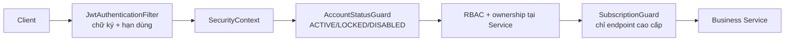
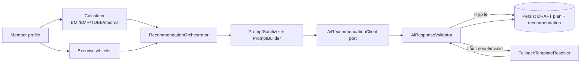

# 13. Quyết định kiến trúc và quy ước hiện thực

## 1. Mục đích và quyết định

Tài liệu này chốt kiến trúc hiện thực cho MVP sau khi đối chiếu phạm vi, Business Rules, API Contract, thiết kế database/JPA và nền tảng Backend đã khởi tạo. Đây là tài liệu bổ sung cho các đặc tả hiện có; không thay thế các hợp đồng tại File 02–12.

**Quyết định:** dự án sử dụng **Modular Layered Monolith**: một ứng dụng Spring Boot triển khai theo module nghiệp vụ, giao tiếp REST/JWT với React và lưu dữ liệu MySQL 8 qua JPA/Flyway. Đây là kiến trúc phù hợp với phạm vi 9 tuần, 32 API hợp đồng, 25 bảng vật lý và các luồng có transaction rõ ràng của MVP.

Kiến trúc đề xuất ban đầu được giữ về hướng tổng thể, nhưng áp dụng các điều chỉnh bắt buộc sau:

1. Resilience4j (`CircuitBreaker`, `TimeLimiter`, `Retry`) và SpringDoc OpenAPI là **bắt buộc**, vì đã được quy định tại NFR-04, NFR-12 và NFR-13.
2. Tên enum, trạng thái và nguồn recommendation phải khớp schema Flyway và Business Rules, không dùng các trạng thái chưa được đặc tả.
3. `admin` là vai trò/điểm vào API, không phải module nghiệp vụ trùng lặp. Quản trị gói tập và bài tập vẫn thuộc module `membership` và `exercise`.
4. Fallback là chính sách điều phối khi AI lỗi; không tạo một tầng Strategy/Factory chỉ để gắn tên pattern. Adapter chỉ dùng tại ranh giới nhà cung cấp AI, còn factory dùng khi chọn template fallback thực sự.

---

## 2. Ràng buộc kiến trúc

| Ràng buộc | Quyết định hiện thực |
| --- | --- |
| MVP và thời gian | Modular monolith; không tách microservice, Kafka/RabbitMQ, CQRS, Event Sourcing hoặc Spring StateMachine. |
| API | REST dưới `/api/v1`, JWT stateless, DTO request/response; không serialize JPA Entity. |
| Database | MySQL 8, Flyway là nguồn sở hữu DDL duy nhất; Hibernate chỉ `validate`, OSIV tắt. |
| Dữ liệu thời gian | Audit timestamp dùng `Instant`/UTC; ngày nghiệp vụ dùng `LocalDate` với `Clock` cấu hình `Asia/Ho_Chi_Minh`. |
| AI | Backend sở hữu tính toán số học, whitelist và hậu kiểm; LLM chỉ tạo đề xuất có cấu trúc. |
| Độ tin cậy AI | Mỗi lần gọi tối đa 15 giây, tối đa một retry và toàn bộ endpoint tối đa 30 giây; sau đó fallback theo NFR-02/NFR-04/NFR-13. |
| Bảo mật | `DB_PASSWORD`, JWT secret và AI API key chỉ từ biến môi trường; `.env` bị ignore chỉ dùng để Docker Compose hoặc IDE/shell nạp biến cục bộ. JWT filter nạp identity/roles qua `CustomUserDetailsService` nhưng không quyết định `accountStatus` hoặc subscription; các guard kiểm tra riêng. |

---

## 3. Cấu trúc Backend

Mã đặt dưới `com.thinh.smartgym`. `common` chỉ chứa thành phần kỹ thuật dùng chung, không trở thành nơi chứa logic nghiệp vụ không có chủ sở hữu.

```text
com.thinh.smartgym
├── common
│   ├── response            # ApiResponse, ErrorResponse, PageResponse
│   ├── config              # Clock, Jackson, JPA, OpenAPI configuration
│   ├── exception           # exception nghiệp vụ và @RestControllerAdvice
│   ├── persistence         # BaseEntity
│   └── validation          # validator dùng chung, không phụ thuộc module
├── security                # SecurityFilterChain, JWT, principal, guards
├── auth                    # User, Role, UserRole, register/login/current user
├── member                  # MemberProfile và dữ liệu thể trạng
├── membership              # package, subscription, renewal và state policy
├── exercise                # catalog, filter/specification và whitelist query
├── recommendation
│   ├── calculator          # BMI/BMR/TDEE/macros thuần, stateless
│   ├── ai                  # AI port, provider adapter, prompt, validator
│   ├── fallback            # template resolver/generator
│   └── service             # điều phối generate → validate → persist
├── workout                 # plan, activation, session và workout log
└── progress                # body progress và biểu đồ dữ liệu chuỗi thời gian
```

Mỗi module có thể gồm `controller`, `dto`, `service`, `repository`, `entity`, `mapper` và `policy` tùy nhu cầu. Chỉ tạo package khi có mã thuộc package đó; ví dụ, `mapper` thủ công có thể để cạnh DTO khi module còn nhỏ.

```text
Controller → Service / Policy / Calculator / External Port → Repository → MySQL
```

- **Controller**: HTTP mapping, `@Valid`, lấy Principal, gọi service và trả DTO. Không chứa rule, transaction hoặc truy vấn Repository trực tiếp.
- **Service**: transaction boundary, ownership, orchestration và Business Rules.
- **Repository**: truy vấn/persistence; không ra quyết định nghiệp vụ.
- **Policy/Guard/Validator**: quy tắc có tên rõ ràng, tái sử dụng được và không phải HTTP concern.
- **Mapper**: chuyển đổi Entity/DTO. Giai đoạn MVP dùng mapper thủ công để dễ debug; chỉ cân nhắc MapStruct khi số mapper lặp lại thực sự lớn.

---

## 4. Luồng bảo mật và quyền truy cập



1. `JwtAuthenticationFilter` xác thực chữ ký/hạn dùng, nạp identity và roles qua
   `CustomUserDetailsService`, rồi xây `SecurityContext`. Filter không dùng
   `accountStatus` để chặn request và không gọi nghiệp vụ subscription/profile.
2. `AccountStatusGuard` (qua Method Security/bean được gọi tại các endpoint đã xác thực) kiểm tra tài khoản hiện tại còn `ACTIVE`. `LOCKED` và `DISABLED` bị từ chối theo FR-AUTH-03 và FR-ADMIN-02.
3. RBAC dùng `ROLE_ADMIN`, `ROLE_MEMBER`, `ROLE_PT`; MVP chỉ cung cấp luồng nghiệp vụ Admin/Member. Mọi tài nguyên cá nhân lấy `memberId` từ Principal, không từ request client.
4. `SubscriptionGuard` chỉ áp dụng cho tạo recommendation, kích hoạt plan và ghi workout log. Điều kiện là `ACTIVE`, `startDate <= today < endDate`; xem lịch sử vẫn được phép khi gói hết hạn.

`@EnableMethodSecurity`, `@PreAuthorize` và service ownership check được dùng kết hợp: annotation chặn role/guard từ sớm, service vẫn kiểm tra chủ sở hữu trong câu truy vấn nghiệp vụ.

---

## 5. State, transaction và concurrency

Tất cả enum JPA dùng `@Enumerated(EnumType.STRING)` và DDL/Flyway là nguồn kiểm tra cuối cùng.

| Nhóm | Giá trị được phép |
| --- | --- |
| `AccountStatus` | `ACTIVE`, `LOCKED`, `DISABLED` |
| `SubscriptionStatus` | `PENDING`, `ACTIVE`, `EXPIRED`, `CANCELLED` |
| `SubscriptionRenewalRequestStatus` | `PENDING`, `PROCESSED` |
| `WorkoutPlanStatus` | `DRAFT`, `ACTIVE`, `ARCHIVED` |
| `WorkoutPlan.recommendationSource` | `MANUAL`, `AI_GENERATED`, `FALLBACK_TEMPLATE` |
| `AiRecommendation.recommendationSource` | `AI_GENERATED`, `FALLBACK_TEMPLATE` |
| `AiRecommendation.validationStatus` | `VALIDATED`, `FALLBACK_APPLIED` |

- Không thêm `REJECTED` cho renewal hoặc `AI` cho recommendation source nếu chưa có migration và thay đổi đặc tả đi kèm.
- Không dùng framework State Machine. `SubscriptionStatePolicy` và `WorkoutPlanStatePolicy` kiểm tra các transition đã chốt tại BR-24, BR-25 và BR-26.
- `@Transactional` đặt ở service. Luồng phê duyệt subscription/gia hạn và activation plan phải hoàn tất toàn bộ hoặc rollback toàn bộ.
- Giữ `@Version` tại `MemberSubscription`, `SubscriptionRenewalRequest`, `WorkoutPlan`; kết hợp query lock theo phạm vi Member tại các transition đa dòng, đúng File 12. Xung đột trả `CON-001`/HTTP 409.

---

## 6. AI Hybrid và fallback



Quy ước hiện thực:

- `AiRecommendationClient` là interface nội bộ. Mỗi `OpenAi...Client` hoặc `Gemini...Client` là adapter riêng; `RecommendationOrchestrator` không biết payload HTTP của provider.
- `PromptSanitizerService` chỉ nhận field theo allowlist/enum, giới hạn độ dài, loại control character và không hỗ trợ `customPrompt` tự do.
- `AiResponseValidator` là cổng chung cho response AI **và** fallback: kiểm tra JSON schema, số ngày/số bữa, whitelist, chống chỉ định, sets/reps/RPE/rest và dietary constraints. Không âm thầm clamp dữ liệu sai.
- Resilience4j điều khiển timeout/retry/circuit breaker. Retry HTTP chỉ dành cho timeout, 429 và 5xx; response sai rule/schema có tối đa một lần yêu cầu tái sinh, sau đó fallback.
- `FallbackTemplateResolver` chọn template theo dữ liệu thực tế (level, số ngày, whitelist). Chỉ dùng Factory/Strategy tại điểm có nhiều thuật toán/template thay thế nhau; không tạo pattern rỗng.
- Sau khi hợp lệ, backend lưu `WorkoutPlan` ở `DRAFT`, `AiRecommendation`, `NutritionMealSuggestion` trong cùng transaction và trả `calculatedTargets` do backend sở hữu. Khi fallback thành công, HTTP 200 kèm `AI_TIMEOUT` hoặc `AI_RESPONSE_INVALID` theo API Draft.

---

## 7. Cross-cutting concerns

- Response tuân thủ `ApiResponse<T>`, `ErrorResponse` và `PageResponse<T>` theo File 10. `@RestControllerAdvice` ánh xạ validation, not-found, conflict, access denied, external AI và optimistic-lock sang Error Code Registry File 05.
- Validation gồm Bean Validation ở DTO, business validation/policy ở service và constraint trong MySQL; không đặt toàn bộ validation trong Entity.
- `ExerciseSpecification` (hoặc query object tương đương) được dùng cho filter/search/pagination động của thư viện bài tập, không dùng để quyết định whitelist an toàn cho AI.
- Log không được chứa password, token, JWT secret, AI API key hoặc toàn bộ physical profile. DTO nhạy cảm không có `toString()` lộ dữ liệu.
- OpenAPI là hợp đồng runtime bổ sung cho API Draft; cấu hình SpringDoc và annotation endpoint khi tạo controller, không dùng Swagger thay thế File 10.

---

## 8. Phụ thuộc và lộ trình

Các dependency hiện có (Web, Validation, JPA, Security, MySQL, Flyway, Actuator, Lombok, Test) là nền tảng đúng. Bổ sung đúng thời điểm dùng, không thêm sớm chỉ để dự phòng:

| Thời điểm | Thành phần cần bổ sung |
| --- | --- |
| Auth/JWT | JWT encoder/decoder tương thích Spring Security và secret từ environment; không hardcode secret. |
| Controller đầu tiên | `springdoc-openapi-starter-webmvc-ui` theo NFR-12. |
| Recommendation/AI | `resilience4j-spring-boot3`, HTTP client và provider SDK/adapter đã chọn. |
| Integration test database | Testcontainers MySQL cho Flyway, unique generated keys và concurrency. |

Frontend đã được khởi tạo bằng React + Vite. Luồng Register dùng `TanStack Query`
cho mutation/server state, React Hook Form + Zod cho form, Axios cho HTTP client và
React Router cho điều hướng; không cần Redux cho MVP. Auth state dùng Context hoặc
Zustand khi triển khai Login và route guard ở các ngày tiếp theo.

Ngoài phạm vi: refresh token, OAuth2 login, Redis, cache phân tán, payment gateway thật, messaging broker, real-time notification, microservices và full Clean Architecture.

---

## 9. Traceability và tiêu chí áp dụng

| Nội dung kiến trúc | Tài liệu nguồn |
| --- | --- |
| Scope MVP và ngoài phạm vi | File 02 |
| Hybrid AI, whitelist, structured output | File 03; FR-EXR-06, FR-WORKOUT-01..03, FR-NUTRITION-05..06 |
| Timeout, circuit breaker, OpenAPI, bảo mật | NFR-02, 04, 06–08, 11–14 |
| State transition, fallback, ownership | BR-04, BR-09A–C, BR-10–13, BR-19, BR-24–28 |
| API format, status/error code, endpoints | File 10 |
| JPA, soft delete, locking, Flyway | File 11 và File 12 |

Một module được xem là hoàn thành khi: controller chỉ dùng DTO; service tuân thủ ownership/transaction/state policy; repository không chứa business decision; migration/Entity khớp File 11–12; test bao phủ rule chính và OpenAPI/API Draft không mâu thuẫn.
